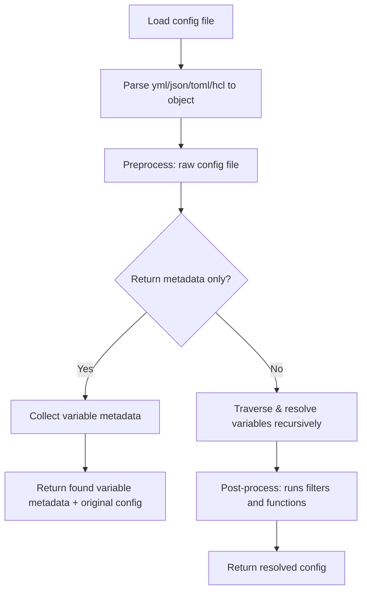

# Configorama

Dynamic configuration values with variable support for yml, json, toml, hcl (Terraform), and other config formats.

Configorama extends your configuration with a powerful variable system that resolves values from CLI options, environment variables, file references, TypeScript/JavaScript files, git data, self-references, conditional expressions, and any custom source you define.

## Key Features

- **Multiple file formats** - yml, yaml, json, toml, ini, hcl (Terraform), TypeScript, JavaScript, markdown
- **Rich variable sources** - env vars, CLI flags, file refs, git data, cron expressions, eval/if expressions
- **Async/sync function execution** - Import and execute JavaScript/TypeScript files with argument passing
- **Self-referencing** - Reference other values within the same config using dot notation
- **Custom variable sources** - Pluggable architecture to add your own variable resolvers
- **Filters and functions** - Transform and combine values with built-in or custom operators
- **Metadata extraction** - Analyze configs without resolving them, or get full resolution history
- **Circular dependency detection** - Helpful error messages instead of infinite loops
- **TypeScript support** - Full type definitions and TypeScript file execution via tsx/ts-node

## Table of Contents

<!-- doc-gen {TOC} collapse=true collapseText="Click to expand" -->
<details>
<summary>Click to expand</summary>

- [Getting Started](#getting-started)
  - [Installation](#installation)
  - [Quick Start](#quick-start)
  - [Running Examples](#running-examples)
- [How It Works](#how-it-works)
  - [Resolution Flow](#resolution-flow)
  - [Analyzing Without Resolving](#analyzing-without-resolving)
  - [Getting Metadata](#getting-metadata)
- [Variable Sources](#variable-sources)
  - [Environment Variables](#environment-variables)
  - [CLI Option Flags](#cli-option-flags)
  - [Parameter Values](#parameter-values)
  - [Self References](#self-references)
  - [File References](#file-references)
  - [Sync/Async File References](#syncasync-file-references)
  - [TypeScript File References](#typescript-file-references)
  - [Terraform HCL Support](#terraform-hcl-support)
  - [Git References](#git-references)
  - [Cron Values](#cron-values)
  - [Eval Expressions](#eval-expressions)
  - [If Expressions](#if-expressions)
  - [Filters (Experimental)](#filters-experimental)
  - [Functions (Experimental)](#functions-experimental)
- [API Reference](#api-reference)
  - [Async API](#async-api)
  - [Sync API](#sync-api)
  - [Analyze API](#analyze-api)
  - [Format Utilities](#format-utilities)
- [Configuration Options](#configuration-options)
  - [Custom Variable Syntax](#custom-variable-syntax)
  - [allowUnknownVariableTypes](#allowunknownvariabletypes)
  - [allowUnresolvedVariables](#allowunresolvedvariables)
  - [Complete Options Reference](#complete-options-reference)
- [Custom Variable Sources](#custom-variable-sources)
  - [Variable Source Types](#variable-source-types)
  - [Creating a Custom Resolver](#creating-a-custom-resolver)
- [CLI Usage](#cli-usage)
  - [Basic Commands](#basic-commands)
  - [Command Options](#command-options)
  - [Examples](#cli-examples)
- [Testing](#testing)
  - [Running Tests](#running-tests)
  - [Test Structure](#test-structure)
  - [Writing Tests](#writing-tests)
- [Deployment](#deployment)
  - [Using with Serverless Framework](#using-with-serverless-framework)
  - [Docker Deployment](#docker-deployment)
  - [CI/CD Integration](#cicd-integration)
- [Troubleshooting](#troubleshooting)
  - [Common Issues](#common-issues)
  - [Debug Mode](#debug-mode)
  - [Circular Dependencies](#circular-dependencies)
- [FAQ](#faq)
- [Advanced Usage](#advanced-usage)
  - [Multi-Stage Resolution](#multi-stage-resolution)
  - [Function Arguments and Context](#function-arguments-and-context)
  - [Programmatic Usage](#programmatic-usage)
- [What's New](#whats-new)
- [Alternative Libraries](#alternative-libraries)
- [Inspiration](#inspiration)

</details>
<!-- end-doc-gen -->

---

## Getting Started

### Installation

**As a library dependency:**

```bash
npm install configorama
```

**As a global CLI tool:**

```bash
npm install -g configorama
```

### Quick Start

**Async API (recommended for most use cases):**

```javascript
const path = require('path')
const configorama = require('configorama')
const cliFlags = require('minimist')(process.argv.slice(2))

// Path to yaml/json/toml config
const myConfigFilePath = path.join(__dirname, 'config.yml')

// Execute config resolution asynchronously
const config = await configorama(myConfigFilePath, { options: cliFlags })

console.log(config) // resolved config
```

**Sync API (for synchronous execution contexts):**

```javascript
const path = require('path')
const configorama = require('configorama')
const cliFlags = require('minimist')(process.argv.slice(2))

// Path to yaml/json/toml config
const myConfigFilePath = path.join(__dirname, 'config.yml')

// Execute config resolution synchronously
const config = configorama.sync(myConfigFilePath, { options: cliFlags })

console.log(config) // resolved config
```

**Example configuration file (`config.yml`):**

```yaml
# Environment variable
apiKey: ${env:API_KEY}

# CLI option (e.g., --stage prod)
environment: ${opt:stage, 'dev'}

# Self-reference to other values
service: my-app
fullName: ${service}-api

# File reference
secrets: ${file(./secrets.yml)}

# Git information
branch: ${git:branch}
commit: ${git:sha1}

# Conditional logic
memorySize: ${if(${environment} === 'prod' ? 1024 : 512)}

# Nested references
database:
  host: ${env:DB_HOST, 'localhost'}
  port: ${env:DB_PORT, 5432}
  name: ${service}-${environment}
```

### Running Examples

The project includes example files demonstrating various features:

```bash
# Clone the repository
git clone https://github.com/DavidWells/configorama
cd configorama

# Install dependencies
npm install

# Run async API example
node examples/using-async-api.js --stage prod

# Run sync API example
node examples/using-sync-api.js --stage dev

# Run zero-config example
node examples/zero-config.js

# Run TypeScript example
node examples/typescript/using-typescript.js
```

---

## How It Works

### Resolution Flow

Configorama creates a dependency graph of your config file and all its dependencies, then resolves values based on their variable sources. The resolution process follows this flow:



**Resolution process:**

1. **Load** - Read config file from disk or accept JavaScript object
2. **Parse** - Convert to JavaScript object (format auto-detected by extension)
3. **Preprocess** - Identify all variables and build dependency graph
4. **Traverse** - Recursively resolve variables in dependency order
5. **Post-process** - Apply filters and functions
6. **Return** - Fully resolved configuration object

### Analyzing Without Resolving

Analyze config structure and variables without actually resolving them:

```javascript
const result = await configorama.analyze('config.yml')

// Returns metadata about variables without resolving them
console.log(result.originalConfig)   // Raw config object
console.log(result.variables)        // All variables found
console.log(result.uniqueVariables)  // Variables grouped by name
console.log(result.fileDependencies) // File references found
```

**Use cases:**
- Validate config structure before deployment
- Generate documentation of required environment variables
- Build dependency graphs for complex configs
- Audit what external resources a config depends on

### Getting Metadata

Resolve config and get detailed metadata about the resolution process:

```javascript
const result = await configorama('config.yml', {
  returnMetadata: true,
  options: { stage: 'prod' }
})

// Returns both resolved config and metadata
console.log(result.config)                    // Fully resolved config
console.log(result.originalConfig)            // Raw config object
console.log(result.metadata.variables)        // Variable info with resolution details
console.log(result.metadata.fileDependencies) // All file dependencies
console.log(result.metadata.summary)          // { totalVariables, requiredVariables, variablesWithDefaults }
console.log(result.resolutionHistory)         // Step-by-step resolution for each path
```

**Metadata structure:**

```javascript
{
  config: { /* resolved config */ },
  originalConfig: { /* raw config */ },
  metadata: {
    variables: [
      {
        variable: '${env:API_KEY}',
        variableType: 'env',
        variableName: 'API_KEY',
        variablePath: 'apiKey',
        defaultValue: null,
        hasDefault: false,
        resolved: true,
        resolvedValue: 'secret-key-123'
      },
      // ... more variables
    ],
    summary: {
      totalVariables: 15,
      requiredVariables: 8,
      variablesWithDefaults: 7
    },
    fileDependencies: ['./secrets.yml', './config.ts']
  },
  resolutionHistory: {
    'apiKey': [
      { step: 1, value: '${env:API_KEY}', type: 'env' },
      { step: 2, value: 'secret-key-123', resolved: true }
    ]
  }
}
```

---

## Variable Sources

Configorama supports multiple variable sources out of the box. All variable syntax follows the pattern `${type:value}` or `${type(value)}`.

### Summary Table

| Variable | Syntax                | Description            | Example |
|----------|-----------------------|------------------------|---------|
| env      | `${env:VAR}`          | Environment variables  | `${env:NODE_ENV}` |
| opt      | `${opt:flag}`         | CLI option flags       | `${opt:stage}` |
| param    | `${param:key}`        | Parameter values       | `${param:domain}` |
| self     | `${key}` or `${self:key}` | Self references    | `${database.host}` |
| file     | `${file(path)}`       | File references        | `${file(./secrets.yml)}` |
| text     | `${text(path)}`       | Raw text file          | `${text(./README.md)}` |
| git      | `${git:value}`        | Git data               | `${git:branch}` |
| cron     | `${cron(expr)}`       | Cron expressions       | `${cron('every 5 minutes')}` |
| eval     | `${eval(expr)}`       | Math/logic expressions | `${eval(10 + 5)}` |
| if       | `${if(expr)}`         | Conditional expressions| `${if(x > 5 ? 'yes' : 'no')}` |

---

### Environment Variables

Access values from `process.env` environment variables.

```yaml
# Basic env var
apiKey: ${env:SECRET_KEY}

# With fallback default if env var not found
apiKeyWithFallback: ${env:SECRET_KEY, 'defaultApiKey'}

# Common patterns
nodeEnv: ${env:NODE_ENV, 'development'}
port: ${env:PORT, 3000}
debug: ${env:DEBUG, false}
```

**How it works:**
- Reads from `process.env` at resolution time
- Supports default values with comma syntax
- Throws error if env var not found and no default provided (unless `allowUnresolvedVariables` is set)

**CLI usage:**

```bash
# Set env var then run
SECRET_KEY=abc123 node app.js

# Or export first
export SECRET_KEY=abc123
node app.js
```

---

### CLI Option Flags

Access values from command line arguments passed via the `options` parameter.

```yaml
# CLI option. Example `cmd --stage dev` makes `bar: dev`
bar: ${opt:stage}

# Composed example makes `foo: dev-hello`
foo: ${opt:stage}-hello

# With default value. If no --stage flag, uses 'dev'
environment: ${opt:stage, 'dev'}

# Boolean flags
verbose: ${opt:verbose, false}

# Nested paths
region: ${opt:aws.region, 'us-east-1'}
```

**How it works:**
- Reads from the `options` object passed to configorama
- Typically populated from CLI args using `minimist` or similar parser
- Supports dot-notation for nested option paths

**Example:**

```javascript
const minimist = require('minimist')
const configorama = require('configorama')

const argv = minimist(process.argv.slice(2))
// argv = { stage: 'prod', verbose: true, aws: { region: 'eu-west-1' } }

const config = await configorama('config.yml', { options: argv })
```

```bash
# Command line
node app.js --stage prod --verbose --aws.region eu-west-1
```

---

### Parameter Values

Access parameter values via `${param:key}`. Parameters follow a resolution hierarchy:

1. **CLI params** (`--param="key=value"`) - highest priority
2. **Stage-specific params** (`stages.<stage>.params`)
3. **Default params** (`stages.default.params`)

```yaml
# Direct parameter reference
appDomain: ${param:domain}

# Parameter with fallback
apiKey: ${param:apiKey, 'default-api-key'}

# Stage-specific parameters defined in config
stages:
  dev:
    params:
      domain: dev.myapp.com
      dbHost: localhost
  prod:
    params:
      domain: myapp.com
      dbHost: prod-db.myapp.com
  default:
    params:
      domain: default.myapp.com
      dbPort: 3306
```

**CLI Usage:**

```bash
# Single param
node app.js --param="domain=example.com"

# Multiple params
node app.js --param="domain=example.com" --param="apiKey=secret123"

# With stage selection
node app.js --stage prod --param="domain=cli-override.com"
```

**Code Usage:**

```javascript
const config = await configorama('config.yml', {
  options: {
    stage: 'prod',
    param: ['domain=cli-override.com', 'apiKey=secret']
  }
})
```

**Resolution order example:**

```yaml
stages:
  prod:
    params:
      domain: prod.myapp.com  # 2. Stage-specific
  default:
    params:
      domain: default.myapp.com  # 3. Default fallback

appUrl: ${param:domain}
```

```bash
# CLI override (highest priority)
node app.js --stage prod --param="domain=cli.myapp.com"
# Result: appUrl = 'cli.myapp.com'

# Stage param (no CLI override)
node app.js --stage prod
# Result: appUrl = 'prod.myapp.com'

# Default param (no CLI override, no stage match)
node app.js --stage staging
# Result: appUrl = 'default.myapp.com'
```

---

### Self References

Reference values from other key paths in the same configuration file using dot notation.

```yaml
foo: bar

zaz:
  matazaz: 1
  wow:
    cool: 2

# Shorthand dot.prop reference
two: ${foo}  # Resolves to 'bar'

# Explicit self file reference
one: ${self:foo}  # Resolves to 'bar'

# Dot prop reference traverses objects
three: ${zaz.wow.cool}  # Resolves to 2

# Complex nested references
database:
  host: localhost
  port: 5432
  name: mydb

connectionString: postgres://${database.host}:${database.port}/${database.name}
# Resolves to: postgres://localhost:5432/mydb

# Array access
items:
  - first
  - second
  - third

selectedItem: ${items[1]}  # Resolves to 'second'
```

**How it works:**
- Uses dot-notation for nested object access
- Supports array index access with bracket notation
- Resolves in dependency order (referenced values resolved first)
- Detects circular references and throws helpful errors

---

### File References

Import values from external yml, json, toml, hcl, or other supported files by relative path.

```yaml
# Import full yml/json/toml/hcl file via relative path
fileRef: ${file(./subFile.yml)}

# Import sub values from files (topLevel key from other-config.yml)
fileValue: ${file(./other-config.yml):topLevel}

# Import nested sub values (nested.value from other-config.json)
fileValueSubKey: ${file(./other-config.json):nested.value}

# Fallback to default value if file not found
fallbackValueExample: ${file(./not-found.yml), 'fall back value'}

# Relative paths from config file location
secrets: ${file(../shared/secrets.yml)}

# Import from subdirectory
dbConfig: ${file(./config/database.yml):production}
```

**Supported file types (extensions are case-insensitive):**

| Type | Extensions |
|------|------------|
| TypeScript | `.ts`, `.tsx`, `.mts`, `.cts` |
| JavaScript | `.js`, `.cjs` |
| ESM | `.mjs`, `.esm` |
| YAML | `.yml`, `.yaml` |
| TOML | `.toml`, `.tml` |
| INI | `.ini` |
| JSON | `.json`, `.json5`, `.jsonc` |
| HCL (Terraform) | `.tf`, `.hcl`, `.tf.json` |
| Markdown | `.md`, `.mdx`, `.markdown`, `.mdown`, `.mkdn`, `.mkd` |

**Path resolution:**
- Relative paths resolved from config file's directory
- Absolute paths supported
- `~` home directory expansion NOT supported (use absolute paths)

**Example file structure:**

```text
project/
├── config.yml            # Main config
├── secrets.yml           # Secrets file
└── environments/
    ├── dev.yml
    └── prod.yml
```

```yaml
# config.yml
secrets: ${file(./secrets.yml)}
environment: ${file(./environments/${opt:stage}.yml)}
```

---

### Sync/Async File References

Execute JavaScript files and use their exported function's return value. Functions can be synchronous or asynchronous and receive arguments from your config.

```yaml
# Async function execution
asyncJSValue: ${file(./async-value.js)}

# Sync function execution
syncJSValue: ${file(./sync-value.js)}

# With arguments (resolved before being passed)
secrets: ${file(./fetch-secrets.js, ${self:environment}, ${self:region})}
```

**JavaScript file example (`async-value.js`):**

```javascript
async function fetchSecretsFromRemoteStore() {
  // Simulate async operation (AWS Secrets Manager, HashiCorp Vault, etc.)
  await new Promise(resolve => setTimeout(resolve, 1000))
  return {
    apiKey: 'secret-key-123',
    dbPassword: 'db-password-456'
  }
}

module.exports = fetchSecretsFromRemoteStore
```

**Sync function example (`sync-value.js`):**

```javascript
function getEnvironmentConfig() {
  return {
    timeout: 5000,
    retries: 3,
    logLevel: process.env.NODE_ENV === 'production' ? 'error' : 'debug'
  }
}

module.exports = getEnvironmentConfig
```

#### Passing Arguments to Functions

You can pass resolved values from your config as arguments to JavaScript/TypeScript functions:

```yaml
foo: bar
baz:
  qux: quux

# Pass resolved values as arguments
secrets: ${file(./fetch-secrets.js, ${self:foo}, ${self:baz})}
```

Arguments are passed in order, with the config context always last:

```javascript
/**
 * @param {string} foo - First arg from YAML ('bar')
 * @param {object} baz - Second arg from YAML ({ qux: 'quux' })
 * @param {import('configorama').ConfigContext} ctx - Config context (always last)
 */
async function fetchSecrets(foo, baz, ctx) {
  console.log(foo)  // 'bar'
  console.log(baz)  // { qux: 'quux' }

  // Access config context
  console.log(ctx.originalConfig)  // Original unresolved config
  console.log(ctx.currentConfig)   // Current partially-resolved config
  console.log(ctx.options)         // Options passed to configorama

  return { secret: 'value' }
}

module.exports = fetchSecrets
```

#### ConfigContext

The `ctx` parameter (always the last argument) provides access to:

| Property | Description |
|----------|-------------|
| `originalConfig` | The original unresolved configuration object |
| `currentConfig` | The current (partially resolved) configuration |
| `options` | Options passed to configorama (populates `${opt:xyz}` variables) |

**TypeScript users can import the type:**

```typescript
import type { ConfigContext } from 'configorama'

async function fetchSecrets(
  foo: string,
  baz: { qux: string },
  ctx: ConfigContext
): Promise<string> {
  // Full type support for ctx properties
  return 'secret-value'
}

export = fetchSecrets
```

#### Functions Without Arguments

If you don't need arguments, the function still receives `ctx` as its only parameter:

```javascript
// No args - ctx is the only parameter
async function getSecrets(ctx) {
  return ctx.options.stage === 'prod'
    ? 'prod-secret'
    : 'dev-secret'
}

module.exports = getSecrets
```

---

### TypeScript File References

Execute TypeScript files using tsx (recommended) or ts-node.

**Installation:**

```bash
# Recommended: Modern, fast TypeScript execution
npm install tsx --save-dev

# Alternative: Traditional ts-node approach
npm install ts-node typescript --save-dev
```

**Usage in config:**

```yaml
# TypeScript configuration object
config: ${file(./config.ts)}

# TypeScript async function
secrets: ${file(./async-secrets.ts)}

# Specific property from TypeScript export
database: ${file(./config.ts):database}

# With arguments
apiConfig: ${file(./config.ts, ${opt:stage})}
```

**TypeScript Object Export (`typescript-config.ts`):**

```typescript
interface DatabaseConfig {
  host: string
  port: number
  database: string
  ssl: boolean
}

interface ApiConfig {
  baseUrl: string
  timeout: number
  retries: number
}

interface ConfigObject {
  environment: string
  database: DatabaseConfig
  api: ApiConfig
  features: {
    enableNewFeature: boolean
    debugMode: boolean
  }
}

function createConfig(): ConfigObject {
  return {
    environment: process.env.STAGE || 'development',
    database: {
      host: process.env.DB_HOST || 'localhost',
      port: parseInt(process.env.DB_PORT || '5432'),
      database: process.env.DB_NAME || 'myapp',
      ssl: process.env.NODE_ENV === 'production'
    },
    api: {
      baseUrl: process.env.API_BASE_URL || 'http://localhost:3000',
      timeout: 5000,
      retries: 3
    },
    features: {
      enableNewFeature: process.env.STAGE === 'production',
      debugMode: process.env.DEBUG === 'true'
    }
  }
}

export = createConfig
```

**TypeScript Async Function (`typescript-async.ts`):**

```typescript
interface SecretStore {
  apiKey: string
  dbPassword: string
  jwtSecret: string
}

function delay(ms: number): Promise<void> {
  return new Promise(resolve => setTimeout(resolve, ms))
}

async function fetchSecretsFromVault(): Promise<SecretStore> {
  console.log('Fetching secrets from vault...')

  // Simulate async operations (AWS Secrets Manager, HashiCorp Vault, etc.)
  await delay(100)

  return {
    apiKey: process.env.API_KEY || 'dev-api-key',
    dbPassword: process.env.DB_PASSWORD || 'dev-password',
    jwtSecret: process.env.JWT_SECRET || 'dev-jwt-secret'
  }
}

export = fetchSecretsFromVault
```

**Complete Example Configuration:**

```yaml
# config-with-typescript.yml
service: my-awesome-app

# Load configuration from TypeScript file
provider: ${file(./typescript-config.ts)}

# Load secrets asynchronously from TypeScript file
secrets: ${file(./typescript-async.ts)}

# Mix TypeScript with other configuration
custom:
  stage: ${opt:stage, "dev"}
  region: ${opt:region, "us-east-1"}

  # Use TypeScript files for specific sections
  databaseConfig: ${file(./typescript-config.ts):database}

  # Environment-specific overrides
  stageVariables:
    dev:
      logLevel: debug
    prod:
      logLevel: info

# Regular configuration values
resources:
  description: "Configuration loaded with TypeScript support"

functions:
  hello:
    handler: handler.hello
    environment:
      LOG_LEVEL: ${self:custom.stageVariables.${self:custom.stage}.logLevel}
      DB_HOST: ${self:provider.database.host}
      API_KEY: ${self:secrets.apiKey}
```

**Features:**
- Modern tsx execution (fast, no compilation) with ts-node fallback
- Support for both sync and async TypeScript functions
- Function argument passing via config variables
- Full TypeScript interface support
- Comprehensive error handling with helpful dependency messages

---

### Terraform HCL Support

Configorama supports Terraform HCL (HashiCorp Configuration Language) files, allowing you to parse `.tf`, `.tf.json`, and `.hcl` files.

**Installation:**

HCL parsing requires the optional `@cdktf/hcl2json` package:

```bash
npm install @cdktf/hcl2json
```

**Supported file types:**
- `.tf` - Terraform configuration files
- `.hcl` - Generic HCL files
- `.tf.json` - Terraform JSON configuration files

**Example:**

```javascript
const configorama = require('configorama')

// Parse a Terraform configuration file
const terraformConfig = await configorama('./main.tf')

// Access Terraform variables, resources, locals, etc.
console.log(terraformConfig.variable)  // Variables defined in the file
console.log(terraformConfig.resource)  // Resources
console.log(terraformConfig.locals)    // Local values
console.log(terraformConfig.output)    // Outputs
```

**Importing Terraform files:**

```yaml
# Import Terraform variables from a .tf file
terraformVars: ${file(./terraform/variables.tf)}

# Import specific variable from Terraform file
region: ${file(./terraform/variables.tf):variable.region[0].default}
```

**Variable syntax:**

When loading `.tf` or `.hcl` files directly, configorama automatically uses `$[...]` syntax instead of `${...}` to avoid conflicts with Terraform's native `${var.name}` interpolation. Terraform expressions like `${var.environment}` and `${map(string)}` are preserved as-is.

```javascript
// Loading .tf directly - uses $[...] syntax automatically
const config = await configorama('./main.tf')
// config.locals[0].app_name = "myapp-${var.environment}" (preserved)

// Use $[...] for configorama variables in .tf files
// myvar: $[env:MY_VAR]
// myref: $[file(./other.yml)]  # referenced files also use $[...]
```

When importing `.tf` files from other config formats (yml, json, etc.) via `${file()}`, the parent file's syntax applies. Use `allowUnknownVariableTypes: true` if the imported `.tf` contains Terraform interpolations:

```javascript
const config = await configorama('./config.yml', {
  allowUnknownVariableTypes: true
})
```

**Read-only support:**

Currently, HCL files can be read and parsed, but writing/generating HCL files is not supported.

See [tests/hclTests](./tests/hclTests) for example Terraform files.

---

### Git References

Access repository information from the current working directory's git data.

<!-- doc-gen CODE src=tests/gitVariables/gitVariables.yml -->
```yaml
########################
# Git Variables
########################

# Repo owner/name. E.g. DavidWells/configorama
repo: ${git:repo}
repository: ${git:repository}

# Repo owner. E.g. DavidWells
owner: ${git:owner}
repoOwner: ${git:repoOwner}
repoOwnerDashed: ${git:repo-owner}

# Url. E.g. https://github.com/DavidWells/configorama
url: ${git:url}
repoUrl: ${git:repoUrl}
repoUrlDashed: ${git:repo-url}

# Directory. E.g. https://github.com/DavidWells/configorama/tree/master/tests/gitVariables
dir: ${git:dir}
directory: ${git:directory}

# Branch
branch: ${git:branch}

# Commits. E.g. 785fa6b982d67b079d53099d57c27fa87c075211
commit: ${git:commit}

# Sha1. E.g. 785fa6b
sha1: ${git:sha1}

# Message. E.g. 'Initial commit'
message: ${git:message}

# Remotes. E.g. https://github.com/DavidWells/configorama
remote: ${git:remote}
remoteDefined: ${git:remote('origin')}
remoteDefinedNoQuotes: ${git:remote(origin)}

# Tags. E.g. v0.5.2-1-g785fa6b
tag: ${git:tag}
# Describe. E.g. v0.5.2-1-g785fa6b
describe: ${git:describe}

# Timestamp. E.g. 2025-01-28T07:28:53.000Z
gitTimestampRelativePath: ${git:timestamp('../../package.json')}
# Timestamp. E.g. 2025-01-28T07:28:53.000Z
gitTimestampAbsolutePath: ${git:timestamp('package.json')}
```
<!-- end-doc-gen -->

**How it works:**
- Reads git data from `.git` directory in current working directory or parent directories
- Executes git commands via child process
- Throws error if not in a git repository

---

### Cron Values

Convert human-readable time expressions into standard cron syntax.

```yaml
# Basic patterns
everyMinute: ${cron('every minute')}        # * * * * *
everyHour: ${cron('every hour')}            # 0 * * * *
everyDay: ${cron('every day')}              # 0 0 * * *
weekdays: ${cron('weekdays')}               # 0 0 * * 1-5
midnight: ${cron('midnight')}               # 0 0 * * *
noon: ${cron('noon')}                       # 0 12 * * *

# Interval patterns
every5Minutes: ${cron('every 5 minutes')}   # */5 * * * *
every15Minutes: ${cron('every 15 minutes')} # */15 * * * *
every2Hours: ${cron('every 2 hours')}       # 0 */2 * * *
every3Days: ${cron('every 3 days')}         # 0 0 */3 * *

# Specific times
at930: ${cron('at 9:30')}                   # 30 9 * * *
at930pm: ${cron('at 9:30 pm')}              # 30 21 * * *
at1200: ${cron('at 12:00')}                 # 0 12 * * *
at1230am: ${cron('at 12:30 am')}            # 30 0 * * *

# Weekday patterns
mondayMorning: ${cron('on monday at 9:00')}  # 0 9 * * 1
fridayEvening: ${cron('on friday at 17:00')} # 0 17 * * 5
sundayNoon: ${cron('on sunday at 12:00')}    # 0 12 * * 0

# Pre-existing cron expressions (pass through)
customCron: ${cron('15 2 * * *')}           # 15 2 * * *
```

**Supported expressions:**
- `every N minutes/hours/days`
- `at HH:MM [am/pm]`
- `on [weekday] at HH:MM`
- `midnight`, `noon`, `weekdays`
- Standard cron syntax (passed through unchanged)

---

### Eval Expressions

Evaluate mathematical and logical expressions safely (without using JavaScript's `eval`). Uses the `subscript` library for safe expression evaluation.

```yaml
# Math operations
sum: ${eval(10 + 5)}                  # 15
multiply: ${eval(10 * 3)}             # 30
divide: ${eval(100 / 4)}              # 25
modulo: ${eval(17 % 5)}               # 2

# Comparisons (returns boolean)
isGreater: ${eval(200 > 100)}         # true
isLess: ${eval(100 > 200)}            # false
isEqual: ${eval(10 == 10)}            # true

# String comparisons
isEqual: ${eval("hello" == "hello")}  # true
strictEqual: ${eval("foo" === "foo")} # true
notEqual: ${eval("a" != "b")}         # true

# Complex expressions
complex: ${eval((10 + 5) * 2)}        # 30
percentage: ${eval((75 / 100) * 200)} # 150

# With variables
threshold: 50
value: 75
aboveThreshold: ${eval(${value} > ${threshold})}  # true
```

**Supported operators:**

| Category | Operators |
|----------|-----------|
| Arithmetic | `+` `-` `*` `/` `%` |
| Comparison | `==` `!=` `===` `!==` `>` `<` `>=` `<=` |
| Logical | `&&` `\|\|` `!` |
| Grouping | `( )` |

**Security:**
- Does NOT use JavaScript's `eval()`
- Uses safe expression parser (subscript)
- No access to global scope or functions
- Only mathematical and logical operations allowed

---

### If Expressions

Conditional expressions using ternary syntax. This is an alias for `eval` with a more intuitive name for conditionals.

```yaml
# Basic ternary (condition ? "yes" : "no")
status: ${if(5 > 3 ? "yes" : "no")}           # "yes"

# With variables
threshold: 50
value: 75
result: ${if(${value} > ${threshold} ? "above" : "below")}  # "above"

# Nested ternary (if/else if/else)
score: 85
grade: ${if(${score} >= 90 ? "A" : ${score} >= 80 ? "B" : "C")}  # "B"

# Boolean result (no ternary needed)
isValid: ${if(${value} > 0)}               # true

# Logical operators
enabled: true
count: 5
canProceed: ${if(${enabled} && ${count} > 0)}  # true
hasIssues: ${if(!${enabled} || ${count} == 0)} # false
```

**Supported operators:**

| Category | Operators |
|----------|-----------|
| Comparison | `==` `!=` `===` `!==` `>` `<` `>=` `<=` |
| Logical | `&&` `\|\|` `!` |
| Nullish | `??` |
| Ternary | `condition ? "yes" : "no"` |

**Serverless deployment examples:**

```yaml
service: my-service

provider:
  name: aws
  stage: ${opt:stage, 'dev'}
  region: ${opt:region, 'us-east-1'}

custom:
  # Different memory by stage
  memorySize: ${if(${provider.stage} === "prod" ? 1024 : 512)}

  # Different log retention by stage
  logRetention: ${if(${provider.stage} === "prod" ? 30 : 7)}

  # Enable features per environment
  enableDebugEndpoints: ${if(${provider.stage} !== "prod")}
  enableMetrics: ${if(${provider.stage} === "prod")}

  # Regional settings
  replicaCount: ${if(${provider.region} === "us-east-1" ? 3 : 1)}

  # Conditional IAM role (use predefined role in prod, inline in dev)
  useExternalRole: ${if(${provider.stage} === "prod")}
  role: ${if(${custom.useExternalRole} ? "arn:aws:iam::123:role/prod-role" : null)}

functions:
  api:
    handler: handler.api
    memorySize: ${custom.memorySize}

  # Debug function - only deployed in non-prod
  debug:
    handler: handler.debug
    enabled: ${custom.enableDebugEndpoints}

  # Metrics processor - only in prod
  metricsProcessor:
    handler: handler.metrics
    enabled: ${custom.enableMetrics}
```

---

### Filters (Experimental)

Pipe resolved values through transformation functions like case conversion.

```yaml
# String transformations
toUpperCaseString: ${'value' | toUpperCase }  # 'VALUE'
toLowerCaseString: ${'VALUE' | toLowerCase }  # 'value'

# Case conversions
toKebabCaseString: ${'valueHere' | toKebabCase }  # 'value-here'
toCamelCaseString: ${'value-here' | toCamelCase } # 'valueHere'

# Chaining filters
key: lol_hi
transformed: ${key | toKebabCase | toUpperCase }  # 'LOL-HI'

# With variables
serviceName: MyServiceName
serviceSlug: ${serviceName | toKebabCase}  # 'my-service-name'
```

**Built-in filters:**
- `toUpperCase` - Convert to uppercase
- `toLowerCase` - Convert to lowercase
- `toKebabCase` - Convert to kebab-case
- `toCamelCase` - Convert to camelCase

**Custom filters:**

```javascript
const config = await configorama('config.yml', {
  filters: {
    // Custom filter
    reverse: (value) => value.split('').reverse().join(''),
    // Filter with options
    truncate: (value, length = 10) => value.substring(0, length)
  }
})
```

```yaml
# Using custom filters
reversed: ${'hello' | reverse}  # 'olleh'
truncated: ${'very long string' | truncate(5)}  # 'very '
```

---

### Functions (Experimental)

Apply built-in functions to combine, transform, or manipulate values.

```yaml
object:
  one: once
  two: twice

objectTwo:
  three: third
  four: fourth

# Merge objects
mergeObjects: ${merge(${object}, ${objectTwo})}
# Result: { one: 'once', two: 'twice', three: 'third', four: 'fourth' }

# String concatenation
fullName: ${concat(${firstName}, ' ', ${lastName})}

# Array operations
items:
  - a
  - b
  - c

joinedItems: ${join(${items}, ', ')}  # 'a, b, c'
```

**Built-in functions:**
- `merge(obj1, obj2, ...)` - Merge multiple objects
- `concat(str1, str2, ...)` - Concatenate strings
- `join(array, separator)` - Join array elements

**Custom functions:**

```javascript
const config = await configorama('config.yml', {
  functions: {
    // Custom function
    add: (a, b) => a + b,
    // Function with multiple args
    between: (val, min, max) => val >= min && val <= max
  }
})
```

```yaml
# Using custom functions
sum: ${add(5, 10)}  # 15
value: 75
inRange: ${between(${value}, 50, 100)}  # true
```

---

## API Reference

### Async API

The primary async API for resolving configurations.

**Signature:**

```typescript
function configorama<T = any>(
  configPathOrObject: string | object,
  settings?: ConfigoramaSettings
): Promise<T | ConfigoramaResult<T>>
```

**Parameters:**

| Parameter | Type | Required | Description |
|-----------|------|----------|-------------|
| `configPathOrObject` | `string \| object` | Yes | Path to config file or raw JavaScript object |
| `settings` | `ConfigoramaSettings` | No | Configuration options |

**Settings object:**

```typescript
interface ConfigoramaSettings {
  options?: Record<string, any>          // CLI flags for ${opt:xyz}
  syntax?: string | RegExp               // Custom variable syntax
  configDir?: string                     // Working directory for relative paths
  variableSources?: VariableSource[]     // Custom variable resolvers
  filters?: Record<string, Function>     // Custom filter functions
  functions?: Record<string, Function>   // Custom functions
  allowUnknownVariableTypes?: boolean | string[]  // Allow unknown var types
  allowUnresolvedVariables?: boolean | string[]   // Allow unresolved vars
  allowUndefinedValues?: boolean         // Allow undefined in output
  returnMetadata?: boolean               // Return metadata with config
  mergeKeys?: string[]                   // Keys to merge in arrays
  filePathOverrides?: Record<string, string>  // Override file paths
}
```

**Returns:**

- If `returnMetadata: false` (default): `Promise<T>` - Resolved config object
- If `returnMetadata: true`: `Promise<ConfigoramaResult<T>>` - Object with config and metadata

**Example:**

```javascript
const configorama = require('configorama')

// Basic usage
const config = await configorama('./config.yml')

// With options
const config = await configorama('./config.yml', {
  options: { stage: 'prod', region: 'us-east-1' },
  allowUnknownVariableTypes: ['ssm', 'cf']
})

// With metadata
const result = await configorama('./config.yml', {
  returnMetadata: true,
  options: { stage: 'prod' }
})

console.log(result.config)           // Resolved config
console.log(result.metadata)         // Variable metadata
console.log(result.resolutionHistory) // Resolution steps
```

---

### Sync API

Synchronous API for blocking config resolution.

**Signature:**

```typescript
function configorama.sync<T = any>(
  configPathOrObject: string | object,
  settings?: ConfigoramaSettings
): T
```

**Parameters:**

Same as async API, but `dynamicArgs` cannot be a function (must be serializable).

**Returns:**

`T` - Resolved config object (synchronously)

**Limitations:**

- Cannot use async functions in JavaScript/TypeScript file references
- `dynamicArgs` must be serializable (not a function)
- CLI args automatically parsed from `process.argv` if `options` not provided

**Example:**

```javascript
const configorama = require('configorama')

// Basic sync usage
const config = configorama.sync('./config.yml')

// With options
const config = configorama.sync('./config.yml', {
  options: { stage: 'dev' }
})
```

---

### Analyze API

Analyze config structure without resolving variables.

**Signature:**

```typescript
function configorama.analyze(
  configPathOrObject: string | object,
  settings?: ConfigoramaSettings
): Promise<AnalyzeResult>
```

**Returns:**

```typescript
interface AnalyzeResult {
  originalConfig: object         // Raw config object
  variables: Variable[]          // All variables found
  uniqueVariables: Record<string, Variable[]>  // Variables grouped by name
  fileDependencies: string[]     // File references
}

interface Variable {
  variable: string               // Full variable syntax (e.g., '${env:KEY}')
  variableType: string           // Type (e.g., 'env', 'opt', 'file')
  variableName: string           // Name/path (e.g., 'KEY')
  variablePath: string           // Location in config (e.g., 'database.host')
  defaultValue: any              // Default value if provided
  hasDefault: boolean            // Whether default exists
}
```

**Example:**

```javascript
const configorama = require('configorama')

const analysis = await configorama.analyze('./config.yml')

console.log(`Found ${analysis.variables.length} variables`)
console.log(`File dependencies:`, analysis.fileDependencies)

// List all environment variables required
const envVars = analysis.variables
  .filter(v => v.variableType === 'env' && !v.hasDefault)
  .map(v => v.variableName)

console.log('Required env vars:', envVars)
```

**Use cases:**
- Generate documentation of required environment variables
- Validate config structure in CI/CD
- Build dependency graphs
- Audit external dependencies before resolution

---

### Format Utilities

Parse various config formats to JavaScript objects.

**Available parsers:**

```javascript
const { format } = require('configorama')

// Parse YAML
const yamlObj = format.yaml.parse('key: value')

// Parse JSON5
const jsonObj = format.json5.parse('{ key: "value", }')

// Parse TOML
const tomlObj = format.toml.parse('key = "value"')

// Parse INI
const iniObj = format.ini.parse('[section]\nkey=value')

// Parse HCL (requires @cdktf/hcl2json)
const hclObj = await format.hcl.parse('variable "example" { default = "value" }')
```

**Parser methods:**

Each parser has:
- `parse(content)` - Parse string to JavaScript object
- `stringify(obj)` - Convert JavaScript object to format string (if supported)

---

## Configuration Options

### Custom Variable Syntax

Use the `syntax` option to change the variable delimiters. You can provide a regex string directly or use `buildVariableSyntax()` to generate one with proper character escaping:

```javascript
const configorama = require('configorama')
const { buildVariableSyntax } = require('configorama')

// Using buildVariableSyntax helper (recommended)
const config = await configorama(configFile, {
  syntax: buildVariableSyntax('{{', '}}'),  // Mustache-style: {{env:FOO}}
  options: { stage: 'dev' }
})

// Other examples:
buildVariableSyntax('${{', '}}')   // ${{env:FOO}}
buildVariableSyntax('#{', '}')     // #{env:FOO}
buildVariableSyntax('[[', ']]')    // [[env:FOO]]
buildVariableSyntax('<', '>')      // <env:FOO>
```

**Function signature:**

```typescript
function buildVariableSyntax(
  prefix: string = '${',
  suffix: string = '}',
  excludePatterns: string[] = ['AWS', 'stageVariables']
): string
```

The `buildVariableSyntax()` function:
- Automatically excludes suffix characters from the allowed character class (prevents parsing issues)
- Supports nested variables by excluding `$` and `{` from values
- Third parameter `excludePatterns` is an array of strings to exclude via negative lookahead

**Example with custom syntax:**

```javascript
const config = await configorama('config.yml', {
  syntax: buildVariableSyntax('{{', '}}')
})
```

```yaml
# config.yml with {{ }} syntax
apiKey: {{env:API_KEY}}
stage: {{opt:stage, 'dev'}}
database: {{file(./db.yml)}}
```

---

### allowUnknownVariableTypes

Controls what happens when encountering unregistered variable types (e.g., `${ssm:path}` when `ssm` isn't a registered resolver).

**Type:** `boolean | string[]`

**Default:** `false`

**Behavior:**

```javascript
// Allow ALL unknown types to pass through
const config = await configorama(configFile, {
  allowUnknownVariableTypes: true,
  options: { stage: 'dev' }
})
// Input:  { key: '${ssm:/path/to/secret}' }
// Output: { key: '${ssm:/path/to/secret}' }

// Allow only SPECIFIC unknown types
const config = await configorama(configFile, {
  allowUnknownVariableTypes: ['ssm', 'cf'],  // only these pass through
  options: { stage: 'dev' }
})
// ${ssm:path} and ${cf:stack.output} pass through
// ${custom:thing} throws an error
```

**Use cases:**
- Multi-stage resolution (local resolution, then cloud provider resolves remaining vars)
- Serverless Framework integration (let framework resolve SSM, CloudFormation refs)
- Gradual migration (allow unknown types during transition period)

---

### allowUnresolvedVariables

Controls what happens when a known resolver can't find a value (missing env vars, missing files, etc.).

**Type:** `boolean | string[]`

**Default:** `false`

**Behavior:**

```javascript
// Allow ALL unresolved variables to pass through
const config = await configorama(configFile, {
  allowUnresolvedVariables: true,
  options: { stage: 'dev' }
})
// Input:  { key: '${env:MISSING_VAR}' }
// Output: { key: '${env:MISSING_VAR}' }

// Allow only SPECIFIC types to be unresolved
const config = await configorama(configFile, {
  allowUnresolvedVariables: ['param', 'file'],  // only these pass through
  options: { stage: 'prod' }
})
// Input:  { paramKey: '${param:x}', fileKey: '${file(missing.yml)}' }
// Output: { paramKey: '${param:x}', fileKey: '${file(missing.yml)}' }

// Mixed scenario
const config = await configorama(configFile, {
  allowUnresolvedVariables: ['param', 'file'],
  options: { stage: 'prod' }
})
// Input:  {
//   key: '${env:MISSING_VAR}',
//   paramKey: '${param:x}',
//   fileKey: '${file(missing.yml)}'
// }
// Output: Error thrown because ${env:MISSING_VAR} cannot resolve
// (param and file pass through, but env vars must resolve)
```

**Important notes:**
- This option does NOT apply to `self:` or dotProp variables (e.g., `${foo.bar.baz}`)
- Self-references are local config errors, not external dependencies
- Useful for multi-stage resolution pipelines

**Use cases:**
- Serverless Dashboard resolves params after local resolution
- Gradual migration with optional external dependencies
- Development mode where some services are unavailable

---

### Complete Options Reference

| Option | Type | Default | Description |
|--------|------|---------|-------------|
| `options` | `object` | `{}` | CLI options/flags to populate `${opt:xyz}` variables |
| `syntax` | `string \| RegExp` | `${...}` | Custom variable syntax regex pattern |
| `configDir` | `string` | directory of config file | Working directory for relative file paths |
| `variableSources` | `VariableSource[]` | `[]` | Custom variable sources (see below) |
| `filters` | `Record<string, Function>` | `{}` | Custom filter functions for pipe operator |
| `functions` | `Record<string, Function>` | `{}` | Custom functions for `${fn(...)}` syntax |
| `allowUnknownVariableTypes` | `boolean \| string[]` | `false` | Allow unknown variable types to pass through |
| `allowUnresolvedVariables` | `boolean \| string[]` | `false` | Allow known types that can't resolve to pass through |
| `allowUndefinedValues` | `boolean` | `false` | Allow undefined as a valid end result |
| `returnMetadata` | `boolean` | `false` | Return both config and metadata about variables |
| `mergeKeys` | `string[]` | `[]` | Keys to merge in arrays of objects |
| `filePathOverrides` | `Record<string, string>` | `{}` | Map of file paths to override (for testing/mocking) |

**Legacy options (deprecated):**

| Legacy Option | New Equivalent |
|---------------|----------------|
| `allowUnknownVars` | `allowUnknownVariableTypes` |
| `allowUnknownVariables` | `allowUnknownVariableTypes` |
| `allowUnknownParams` | `allowUnresolvedVariables: ['param']` |
| `allowUnknownFileRefs` | `allowUnresolvedVariables: ['file']` |

---

## Custom Variable Sources

Configorama allows you to bring your own variable sources.

### Variable Source Types

The `source` property defines how the config wizard handles each variable type:

| Source | Description | Wizard Behavior | Examples |
|--------|-------------|-----------------|----------|
| `'user'` | Values provided by user at runtime | Prompt user for value | `env`, `opt` |
| `'config'` | Values from config files or self-references | Check existence, can create | `self`, `file`, `text` |
| `'remote'` | Values from external services | Fetch, prompt if missing, can write back | `ssm`, `vault`, `consul` |
| `'readonly'` | Computed or system-derived values | Display only, cannot modify | `git`, `cron`, `eval` |

**Built-in variable sources and their types:**

| Variable | Source Type | Description |
|----------|-------------|-------------|
| `${env:VAR}` | `user` | Environment variables |
| `${opt:flag}` | `user` | CLI option flags |
| `${param:key}` | `user` | Parameter values |
| `${self:key}` | `config` | Self references |
| `${file(path)}` | `config` | File references |
| `${text(path)}` | `config` | Raw text file references |
| `${git:branch}` | `readonly` | Git repository data |
| `${cron(expr)}` | `readonly` | Cron expression conversion |
| `${eval(expr)}` | `readonly` | Math/logic evaluation |
| `${if(expr)}` | `readonly` | Conditional expressions |

### Creating a Custom Resolver

There are 2 ways to resolve variables from custom sources:

1. **Use built-in JavaScript method** for [sync](https://github.com/DavidWells/configorama/blob/master/tests/syncValues/syncValue.yml) or [async](https://github.com/DavidWells/configorama/blob/master/tests/asyncValues/asyncValue.yml) resolution.

2. **Add your own variable syntax and resolver:**

```javascript
const configorama = require('configorama')

const config = await configorama('path/to/configFile', {
  variableSources: [{
    // Variable type name (used in metadata)
    type: 'consul',

    // Source type for config wizard behavior
    source: 'remote',

    // Prefix shown in syntax examples
    prefix: 'consul',

    // Example syntax for documentation
    syntax: '${consul:path/to/key}',

    // Description for help text
    description: 'Resolves values from Consul KV store',

    // Match variables ${consul:xyz}
    match: RegExp(/^consul:/g),

    // Custom variable source. Must return a promise
    resolver: async (varToProcess, opts, currentObject) => {
      // varToProcess = 'consul:path/to/key'
      const consulPath = varToProcess.replace(/^consul:/, '')

      // Make remote call to consul
      const consulClient = require('consul')()
      const result = await consulClient.kv.get(consulPath)

      return result.Value
    }
  }]
})

console.log(config)
```

**This would match:**

```yaml
key: ${consul:path/to/my/key}
```

**Variable source interface:**

```typescript
interface VariableSource {
  type: string                    // Type name (e.g., 'consul', 'ssm')
  source: 'user' | 'config' | 'remote' | 'readonly'
  prefix?: string                 // Prefix for examples (defaults to type)
  syntax: string                  // Example syntax (e.g., '${consul:key}')
  description?: string            // Help text description
  match: RegExp                   // Regex to match variables
  resolver: (                     // Resolution function
    variable: string,             // Variable string (e.g., 'consul:key')
    options: object,              // Options from configorama call
    currentConfig: object         // Current partially-resolved config
  ) => Promise<any>
  collectMetadata?: () => any     // Optional: collect custom metadata
  metadataKey?: string            // Optional: key for custom metadata
}
```

**Advanced example with AWS SSM:**

```javascript
const AWS = require('aws-sdk')
const ssm = new AWS.SSM()

const config = await configorama('config.yml', {
  variableSources: [{
    type: 'ssm',
    source: 'remote',
    syntax: '${ssm:/path/to/parameter}',
    description: 'Resolves values from AWS Systems Manager Parameter Store',
    match: /^ssm:/,
    resolver: async (variable, options, currentConfig) => {
      const paramPath = variable.replace(/^ssm:/, '')

      try {
        const result = await ssm.getParameter({
          Name: paramPath,
          WithDecryption: true
        }).promise()

        return result.Parameter.Value
      } catch (err) {
        if (options.allowUnresolvedVariables) {
          return `\${${variable}}` // Pass through unresolved
        }
        throw new Error(`SSM parameter not found: ${paramPath}`)
      }
    }
  }]
})
```

```yaml
# config.yml
database:
  password: ${ssm:/myapp/prod/db-password}
  apiKey: ${ssm:/myapp/prod/api-key}
```

---

## CLI Usage

Configorama includes a CLI tool for resolving configs from the command line.

### Basic Commands

```bash
# Resolve a config file
configorama config.yml

# Resolve and write to output file
configorama config.yml --output resolved.json

# Resolve with CLI options
configorama config.yml --stage prod --region us-east-1

# Show info about variables
configorama config.yml --info

# Verify config (check for errors without resolving)
configorama config.yml --verify

# Extract specific path from config
configorama config.yml database.host

# Output as YAML
configorama config.yml --format yaml
```

### Command Options

```text
Usage:
  configorama [options] <file> [path]

Options:
  -h, --help                Show this help message
  -v, --version             Show version number
  -o, --output <file>       Write output to file instead of stdout
  -f, --format <format>     Output format: json, yaml, or js (default: json)
  -d, --debug               Enable debug mode
  -i, --info                Show info about the config
  -V, --verify              Verify the config
  --param <key=value>       Pass parameter values (can be used multiple times)
  --allow-unknown           Allow unknown variables to pass through
  --allow-undefined         Allow undefined values in the final output

Path Extraction:
  configorama config.yml database.host    Extract specific value
  configorama config.yml functions[0]     Extract from array
```

### CLI Examples

**Basic resolution:**

```bash
# Input: config.yml
apiKey: ${env:API_KEY}
stage: ${opt:stage, 'dev'}

# Command
export API_KEY=secret123
configorama config.yml --stage prod

# Output
{
  "apiKey": "secret123",
  "stage": "prod"
}
```

**With parameters:**

```bash
configorama config.yml \
  --stage prod \
  --param "domain=myapp.com" \
  --param "apiKey=secret123"
```

**Extract specific path:**

```bash
# config.yml
database:
  host: localhost
  port: 5432

# Extract database.host
configorama config.yml database.host
# Output: localhost

# Extract database config as JSON
configorama config.yml database --format json
# Output: {"host":"localhost","port":5432}
```

**Output to file:**

```bash
configorama config.yml --output resolved.json
configorama config.yml --output resolved.yml --format yaml
```

**Show variable info:**

```bash
configorama config.yml --info

# Output:
# Found 15 variables
#   env: 5
#   opt: 3
#   self: 4
#   file: 2
#   git: 1
#
# Required environment variables:
#   - API_KEY
#   - DB_HOST
#   - DB_PASSWORD
#
# File dependencies:
#   - ./secrets.yml
#   - ./config/database.yml
```

**Verify without resolving:**

```bash
configorama config.yml --verify

# Output:
# ✓ Config structure valid
# ✓ No circular dependencies
# ✓ All file references exist
# ! Warning: 3 environment variables not set
#   - API_KEY
#   - DB_HOST
#   - DB_PASSWORD
```

---

## Testing

### Running Tests

```bash
# Run all tests
npm test

# Run only fast tests (excludes slow tests)
npm run test:lib

# Run API tests
npm run test:api

# Run tests in a specific directory
npm run test:tests

# Run slow tests only
npm run test:slow

# Watch mode (reruns on file changes)
npm run watch

# Type checking
npm run typecheck
```

### Test Structure

```text
tests/
├── _fixtures/           # Shared test fixtures
├── api/                 # API tests
├── asyncValues/         # Async function resolution tests
├── syncValues/          # Sync function resolution tests
├── cronValues/          # Cron expression tests
├── gitVariables/        # Git variable tests
├── filePathOverrides/   # File path override tests
├── filterTests/         # Filter tests
├── hclTests/            # Terraform HCL tests
├── iniTests/            # INI format tests
├── tomlTests/           # TOML format tests
├── jsTests/             # JavaScript file tests
└── ...                  # More test categories
```

### Writing Tests

Configorama uses the `uvu` test framework. Tests can be run directly with Node.js:

```bash
# Run a single test file
node tests/api/api.test.js
```

**Example test:**

```javascript
const { test } = require('uvu')
const assert = require('uvu/assert')
const path = require('path')
const configorama = require('../src')

test('resolves environment variables', async () => {
  process.env.TEST_VAR = 'test-value'

  const config = await configorama({
    key: '${env:TEST_VAR}'
  })

  assert.equal(config.key, 'test-value')

  delete process.env.TEST_VAR
})

test('handles missing env vars with defaults', async () => {
  const config = await configorama({
    key: '${env:MISSING_VAR, "default"}'
  })

  assert.equal(config.key, 'default')
})

test.run()
```

**Test utilities available at `tests/utils.js`:**

```javascript
const { getFixturePath, loadFixture } = require('./tests/utils')

// Get path to fixture file
const fixturePath = getFixturePath('config.yml')

// Load and parse fixture
const fixtureData = loadFixture('config.yml')
```

---

## Deployment

### Using with Serverless Framework

Configorama can be used as a drop-in replacement for the Serverless Framework variable system.

**serverless.js:**

```javascript
const path = require('path')
const configorama = require('configorama')
const args = require('minimist')(process.argv.slice(2))

// Path to serverless config to be parsed
const yamlFile = path.join(__dirname, 'serverless.config.yml')

module.exports = configorama.sync(yamlFile, { options: args })
```

**serverless.config.yml:**

```yaml
service: my-service

provider:
  name: aws
  runtime: nodejs18.x
  stage: ${opt:stage, 'dev'}
  region: ${opt:region, 'us-east-1'}

  # Environment-specific config
  environment:
    STAGE: ${opt:stage}
    DB_HOST: ${env:DB_HOST}
    API_KEY: ${ssm:/my-service/${opt:stage}/api-key}

custom:
  # Load stage-specific config
  stageConfig: ${file(./config/${opt:stage}.yml)}

  # Git info for tracking
  deploymentInfo:
    branch: ${git:branch}
    commit: ${git:sha1}
    timestamp: ${timestamp}

functions:
  api:
    handler: handler.api
    memorySize: ${if(${provider.stage} === 'prod' ? 1024 : 512)}
    events:
      - http:
          path: /
          method: ANY
```

**Deploy:**

```bash
# Deploy to dev
serverless deploy --stage dev

# Deploy to production
serverless deploy --stage prod --region us-west-2
```

---

### Docker Deployment

**Dockerfile:**

```dockerfile
FROM node:18-alpine

WORKDIR /app

# Copy package files
COPY package*.json ./

# Install dependencies
RUN npm ci --only=production

# Copy application files
COPY . .

# Set environment variables (can be overridden at runtime)
ENV NODE_ENV=production
ENV STAGE=prod

# Run config resolution at build time (optional)
# RUN node -e "require('configorama').sync('./config.yml', { options: { stage: process.env.STAGE } })"

CMD ["node", "index.js"]
```

**docker-compose.yml:**

```yaml
version: '3.8'

services:
  app:
    build: .
    environment:
      - NODE_ENV=production
      - STAGE=prod
      - DB_HOST=postgres
      - DB_PASSWORD=${DB_PASSWORD}
      - API_KEY=${API_KEY}
    depends_on:
      - postgres

  postgres:
    image: postgres:15
    environment:
      POSTGRES_PASSWORD: ${DB_PASSWORD}
```

**Usage:**

```bash
# Build
docker build -t myapp .

# Run with environment variables
docker run \
  -e DB_HOST=mydb.example.com \
  -e DB_PASSWORD=secret \
  -e API_KEY=abc123 \
  myapp
```

---

### CI/CD Integration

**GitHub Actions example (.github/workflows/deploy.yml):**

```yaml
name: Deploy

on:
  push:
    branches: [main]

jobs:
  deploy:
    runs-on: ubuntu-latest

    steps:
      - uses: actions/checkout@v3

      - name: Setup Node.js
        uses: actions/setup-node@v3
        with:
          node-version: '18'

      - name: Install dependencies
        run: npm ci

      - name: Verify config
        run: npx configorama config.yml --verify
        env:
          STAGE: prod
          DB_HOST: ${{ secrets.DB_HOST }}
          DB_PASSWORD: ${{ secrets.DB_PASSWORD }}
          API_KEY: ${{ secrets.API_KEY }}

      - name: Run tests
        run: npm test

      - name: Deploy to production
        run: npm run deploy
        env:
          STAGE: prod
          AWS_ACCESS_KEY_ID: ${{ secrets.AWS_ACCESS_KEY_ID }}
          AWS_SECRET_ACCESS_KEY: ${{ secrets.AWS_SECRET_ACCESS_KEY }}
```

**GitLab CI example (.gitlab-ci.yml):**

```yaml
stages:
  - verify
  - test
  - deploy

verify-config:
  stage: verify
  image: node:18
  script:
    - npm ci
    - npx configorama config.yml --verify --stage $CI_ENVIRONMENT_NAME
  variables:
    STAGE: $CI_ENVIRONMENT_NAME

test:
  stage: test
  image: node:18
  script:
    - npm ci
    - npm test

deploy-production:
  stage: deploy
  image: node:18
  script:
    - npm ci
    - npm run deploy
  environment:
    name: production
  only:
    - main
  variables:
    STAGE: prod
```

---

## Troubleshooting

### Common Issues

**Q: Variable not resolving**

```yaml
# Problem
apiKey: ${env:API_KEY}
# Error: Environment variable 'API_KEY' not found
```

**Solutions:**
1. Ensure environment variable is set: `echo $API_KEY`
2. Check variable name spelling
3. Use default value: `${env:API_KEY, 'default'}`
4. Allow unresolved vars: `allowUnresolvedVariables: ['env']`

---

**Q: Circular dependency error**

```yaml
# Problem
a: ${self:b}
b: ${self:a}
# Error: Circular variable dependency detected: b → a → b
```

**Solutions:**
1. Restructure config to remove circular reference
2. Use intermediate values to break the cycle
3. Consider if one value should be a constant instead

---

**Q: File not found**

```yaml
# Problem
secrets: ${file(./secrets.yml)}
# Error: File not found: ./secrets.yml
```

**Solutions:**
1. Check file path is correct relative to config file
2. Ensure file exists: `ls -la secrets.yml`
3. Use absolute path: `${file(/absolute/path/to/secrets.yml)}`
4. Add default: `${file(./secrets.yml), {}}`

---

**Q: TypeScript file execution fails**

```yaml
# Problem
config: ${file(./config.ts)}
# Error: Cannot find module 'tsx'
```

**Solutions:**
1. Install tsx: `npm install tsx --save-dev`
2. Or install ts-node: `npm install ts-node typescript --save-dev`
3. Ensure TypeScript file exports correctly: `export = value` or `module.exports = value`

---

**Q: HCL parsing fails**

```yaml
# Problem
terraform: ${file(./main.tf)}
# Error: HCL parsing requires @cdktf/hcl2json
```

**Solutions:**
1. Install dependency: `npm install @cdktf/hcl2json`
2. Ensure HCL file is valid Terraform syntax
3. Check file extension is `.tf`, `.hcl`, or `.tf.json`

---

### Debug Mode

Enable debug mode to see detailed resolution steps:

**CLI:**

```bash
configorama config.yml --debug
```

**Programmatic:**

```javascript
const config = await configorama('config.yml', {
  returnMetadata: true
})

// Inspect resolution history
console.log(config.resolutionHistory)
```

**Environment variable:**

```bash
DEBUG=configorama:* node app.js
```

**Output example:**

```text
configorama:resolve Resolving variable: ${env:API_KEY}
configorama:resolve Type: env, Name: API_KEY
configorama:resolve Resolved to: secret-key-123
configorama:resolve Resolving variable: ${opt:stage}
configorama:resolve Type: opt, Name: stage
configorama:resolve Resolved to: prod
```

---

### Circular Dependencies

Configorama detects circular dependencies and provides helpful error messages:

```yaml
# Direct cycle
a: ${self:b}
b: ${self:a}
```

**Error:**
```text
Circular variable dependency detected: b → a → b

Resolution path:
  1. Started resolving 'b'
  2. Required 'a' (from ${self:b})
  3. Required 'b' (from ${self:a})
  4. Circular dependency detected

To fix this, restructure your config to break the circular reference.
```

**How to fix:**

1. **Use intermediate values:**

```yaml
# Before (circular)
a: ${self:b}
b: ${self:a}

# After (fixed)
base: value
a: ${self:base}
b: ${self:base}
```

2. **Make one value a constant:**

```yaml
# Before (circular)
apiUrl: ${self:baseUrl}/api
baseUrl: ${self:apiUrl}/v1

# After (fixed)
baseUrl: https://example.com
apiUrl: ${self:baseUrl}/api/v1
```

3. **Restructure dependencies:**

```yaml
# Before (circular)
database:
  connectionString: postgres://${database.host}:${database.port}/${database.name}
  host: ${self:database.connectionString}

# After (fixed)
database:
  host: localhost
  port: 5432
  name: mydb
  connectionString: postgres://${database.host}:${database.port}/${database.name}
```

---

## FAQ

**Q: What happens with circular variable dependencies?**

Configorama detects circular dependencies and throws a helpful error instead of hanging forever. See [Circular Dependencies](#circular-dependencies) section for examples and fixes.

---

**Q: Why should I use this?**

Never render a stale configuration file again! Configorama ensures your configs are always up-to-date with the latest environment variables, CLI flags, file contents, and custom sources.

---

**Q: Does this work with `serverless.yml`?**

Yes! Use `serverless.js` as your main entry point. See [Using with Serverless Framework](#using-with-serverless-framework) for full example.

---

**Q: Can I use this with other frameworks/tools?**

Yes! Configorama is framework-agnostic. It works with any tool that accepts a JavaScript object or can import a .js file. Examples:

- **Webpack**: `webpack.config.js`
- **Vite**: `vite.config.js`
- **Jest**: `jest.config.js`
- **ESLint**: `eslint.config.js`
- **Docker Compose**: Generate yaml from resolved config
- **Kubernetes**: Generate manifests from resolved config

---

**Q: How do I handle secrets securely?**

Best practices:

1. **Use environment variables:**
```yaml
apiKey: ${env:API_KEY}
```

2. **Fetch from secret managers:**
```yaml
secrets: ${file(./fetch-secrets.js)}
```

```javascript
// fetch-secrets.js
const AWS = require('aws-sdk')
const ssm = new AWS.SSM()

module.exports = async () => {
  const result = await ssm.getParameter({
    Name: '/myapp/api-key',
    WithDecryption: true
  }).promise()

  return result.Parameter.Value
}
```

3. **Never commit secrets to version control**
4. **Use `.gitignore` for secret files**
5. **Rotate secrets regularly**

---

**Q: Can I use variables in variable syntax?**

Yes! Variables are resolved recursively:

```yaml
stage: prod
configFile: config-${stage}.yml
config: ${file(${configFile})}
# Resolves: ${file(config-prod.yml)}
```

---

**Q: How do I migrate from Serverless Framework variables?**

Configorama is mostly compatible with Serverless Framework variable syntax. Key differences:

1. **Cleaner self-references:**
```yaml
# Serverless
key: ${self:other.key}

# Configorama (both work)
key: ${self:other.key}
key: ${other.key}
```

2. **Numbers as defaults:**
```yaml
# Configorama supports numeric defaults
timeout: ${env:TIMEOUT, 30}
```

3. **Additional variable types:**
- `${cron()}` - Cron expressions
- `${eval()}` - Math expressions
- `${if()}` - Conditionals
- `${git:}` - Git data

---

## Advanced Usage

### Multi-Stage Resolution

Resolve configs in multiple stages, allowing external systems to handle remaining variables:

```javascript
// Stage 1: Local resolution (resolve env, opt, file, etc.)
const partiallyResolved = await configorama('config.yml', {
  options: { stage: 'prod' },
  allowUnresolvedVariables: ['ssm', 'cf'],
  allowUnknownVariableTypes: ['ssm', 'cf']
})

// Stage 2: External system resolves SSM and CloudFormation refs
// (e.g., Serverless Dashboard, AWS CloudFormation, etc.)
const fullyResolved = await externalResolver(partiallyResolved)
```

**Use case:** Serverless Framework + Serverless Dashboard workflow.

---

### Function Arguments and Context

Pass dynamic data from your config to JavaScript/TypeScript functions:

```yaml
environment: prod
region: us-east-1
features:
  enableMetrics: true

# Pass resolved config values as arguments
secrets: ${file(./get-secrets.js, ${environment}, ${region}, ${features})}
```

**get-secrets.js:**

```javascript
async function getSecrets(env, region, features, ctx) {
  // Arguments from YAML
  console.log(env)      // 'prod'
  console.log(region)   // 'us-east-1'
  console.log(features) // { enableMetrics: true }

  // Context (always last argument)
  console.log(ctx.options)        // CLI options
  console.log(ctx.originalConfig) // Original config
  console.log(ctx.currentConfig)  // Partially resolved config

  // Fetch secrets based on arguments
  if (env === 'prod') {
    return await fetchProdSecrets(region)
  }

  return await fetchDevSecrets()
}

module.exports = getSecrets
```

---

### Programmatic Usage

**Custom variable resolver:**

```javascript
const configorama = require('configorama')

// Add custom AWS SSM resolver
const config = await configorama('config.yml', {
  variableSources: [{
    type: 'ssm',
    source: 'remote',
    syntax: '${ssm:/path}',
    description: 'AWS Systems Manager Parameter Store',
    match: /^ssm:/,
    resolver: async (variable) => {
      const AWS = require('aws-sdk')
      const ssm = new AWS.SSM()

      const paramName = variable.replace(/^ssm:/, '')
      const result = await ssm.getParameter({
        Name: paramName,
        WithDecryption: true
      }).promise()

      return result.Parameter.Value
    }
  }]
})
```

**Custom filters:**

```javascript
const config = await configorama('config.yml', {
  filters: {
    // Custom string transformation
    slugify: (str) => str.toLowerCase().replace(/\s+/g, '-'),

    // Custom formatting
    currency: (amount) => `$${parseFloat(amount).toFixed(2)}`,

    // Chained filters work
    upperSnake: (str) => str.toUpperCase().replace(/\s+/g, '_')
  }
})
```

```yaml
# Usage
projectName: My Awesome Project
slug: ${projectName | slugify}  # 'my-awesome-project'

price: 19.99
displayPrice: ${price | currency}  # '$19.99'

constantName: my constant
constName: ${constantName | upperSnake}  # 'MY_CONSTANT'
```

**Custom functions:**

```javascript
const config = await configorama('config.yml', {
  functions: {
    // Timestamp generator
    timestamp: () => new Date().toISOString(),

    // Random ID generator
    uuid: () => require('crypto').randomUUID(),

    // Environment-based selector
    selectByEnv: (prodValue, devValue, env) => {
      return env === 'prod' ? prodValue : devValue
    }
  }
})
```

```yaml
# Usage
createdAt: ${timestamp()}
id: ${uuid()}

environment: ${opt:stage, 'dev'}
timeout: ${selectByEnv(30, 5, ${environment})}
```

---

## What's New

How is this different than the Serverless Framework variable system?

1. **Framework-agnostic** - Use with any tool, not just Serverless Framework

2. **Pluggable** - Add custom variable syntax and sources easily

3. **Filters** - Transform values before resolution:
   ```yaml
   key: ${opt:stage | toUpperCase}
   ```

4. **Cleaner self-references** - No need for `self:` prefix:
   ```yaml
   keyOne:
     subKey: hi

   # Before
   key: ${self:keyOne.subKey}

   # Now (both work)
   key: ${keyOne.subKey}
   key: ${self:keyOne.subKey}
   ```

5. **Numbers as defaults** - Numeric defaults fully supported:
   ```yaml
   timeout: ${env:TIMEOUT, 30}
   port: ${opt:port, 3000}
   ```

6. **Multiple format support** - TOML, YML, JSON, INI, HCL, etc.

7. **Built-in functions** - Combine and transform values:
   ```yaml
   merged: ${merge(${obj1}, ${obj2})}
   ```

8. **TypeScript support** - Execute TypeScript files directly:
   ```yaml
   config: ${file(./config.ts)}
   ```

9. **Conditional expressions** - If/else logic in configs:
   ```yaml
   memory: ${if(${stage} === 'prod' ? 1024 : 512)}
   ```

10. **Metadata extraction** - Analyze configs without resolving:
    ```javascript
    const meta = await configorama.analyze('config.yml')
    ```

---

## Alternative Libraries

- [sls-yaml](https://github.com/01alchemist/sls-yaml) - YAML with variable support
- [yaml-boost](https://github.com/blackflux/yaml-boost) - YAML preprocessing
- [serverless-merge-config](https://github.com/CruGlobal/serverless-merge-config) - Merge Serverless configs
- [serverless-terraform-variables](https://www.npmjs.com/package/serverless-terraform-variables) - Terraform variable support

---

## Inspiration

This is forked from the [Serverless Framework](https://github.com/serverless/serverless/) variable system.

**Mad props to:**

[erikerikson](https://github.com/erikerikson), [eahefnawy](https://github.com/eahefnawy), [HyperBrain](https://github.com/HyperBrain), [ac360](https://github.com/ac360), [gcphost](https://github.com/gcphost), [pmuens](https://github.com/pmuens), [horike37](https://github.com/horike37), [lorengordon](https://github.com/lorengordon), [AndrewFarley](https://github.com/AndrewFarley), [tobyhede](https://github.com/tobyhede), [johncmckim](https://github.com/johncmckim), [mangas](https://github.com/mangas), [e-e-e](https://github.com/e-e-e), [BasileTrujillo](https://github.com/BasileTrujillo), [miltador](https://github.com/miltador), [sammarks](https://github.com/sammarks), [RafalWilinski](https://github.com/RafalWilinski), [indieisaconcept](https://github.com/indieisaconcept), [svdgraaf](https://github.com/svdgraaf), [infiniteluke](https://github.com/infiniteluke), [j0k3r](https://github.com/j0k3r), [craigw](https://github.com/craigw), [bsdkurt](https://github.com/bsdkurt), [aoskotsky-amplify](https://github.com/aoskotsky-amplify), and all the other folks who contributed to the variable system.

**Additionally these tools were very helpful:**

- [yaml-boost](https://github.com/blackflux/yaml-boost)
- [serverless-merge-config](https://github.com/CruGlobal/serverless-merge-config)
- [serverless-terraform-variables](https://www.npmjs.com/package/serverless-terraform-variables)

---

## License

MIT © [David Wells](https://davidwells.io)

## Contributing

Contributions welcome! Please read the [contributing guidelines](CONTRIBUTING.md) first.

## Support

- 🐛 [Report bugs](https://github.com/DavidWells/configorama/issues)
- 💡 [Request features](https://github.com/DavidWells/configorama/issues)
- 📖 [Read the docs](https://github.com/DavidWells/configorama#readme)
- 💬 [Join discussions](https://github.com/DavidWells/configorama/discussions)
