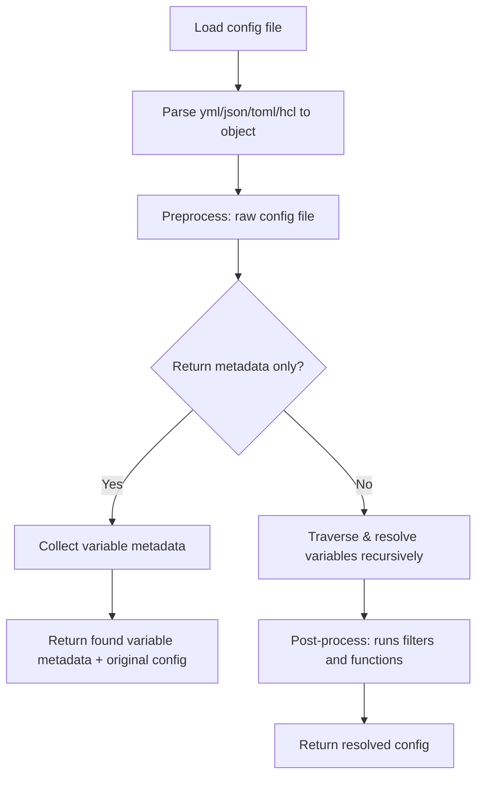

# Configorama

Dynamic configuration values with variable support.

Works with `yml`, `json`, `toml`, `hcl` (Terraform), and other config formats. Supports any format that can be parsed to a plain JavaScript object

## About

Configorama extends your configuration with a powerful variable system. It resolves configuration variables from:

- CLI options
- ENV variables
- File references
- TypeScript file references
- Self references (other keys/values in config)
- Git references
- Cron values
- Eval expressions
- Async/sync JS functions
- Filters (experimental)
- Functions (experimental)
- Any source you'd like...

See [tests](https://github.com/DavidWells/configorama/tree/master/tests) for more examples.

## Table of Contents
<!-- doc-gen {TOC} collapse=true collapseText="Click to expand" -->
<details>
<summary>Click to expand</summary>

- [About](#about)
- [Usage](#usage)
- [How it works](#how-it-works)
- [Variable Sources](#variable-sources)
  - [Environment variables](#environment-variables)
  - [CLI option flags](#cli-option-flags)
  - [Parameter values](#parameter-values)
  - [Self references](#self-references)
  - [File references](#file-references)
  - [Sync/Async file references](#syncasync-file-references)
    - [Passing arguments to functions](#passing-arguments-to-functions)
    - [ConfigContext](#configcontext)
    - [Functions without arguments](#functions-without-arguments)
  - [TypeScript file references](#typescript-file-references)
  - [Git references](#git-references)
  - [Cron Values](#cron-values)
  - [Eval expressions](#eval-expressions)
  - [Filters (experimental)](#filters-experimental)
  - [Functions (experimental)](#functions-experimental)
  - [More Examples](#more-examples)
- [Custom Variable Sources](#custom-variable-sources)
  - [Variable Source Types](#variable-source-types)
- [Options](#options)
  - [Custom Variable Syntax](#custom-variable-syntax)
  - [allowUnknownVariableTypes](#allowunknownvariabletypes)
  - [allowUnresolvedVariables](#allowunresolvedvariables)
- [FAQ](#faq)
- [Whats new](#whats-new)
- [Alt libs](#alt-libs)
- [Inspiration](#inspiration)

</details>
<!-- end-doc-gen -->

## Usage

Async API:

```js
const path = require('path')
const configorama = require('configorama')
const cliFlags = require('minimist')(process.argv.slice(2))

// Path to yaml/json/toml config
const myConfigFilePath = path.join(__dirname, 'config.yml')
// Execute config resolution asyncronously
const config = await configorama(myConfigFilePath, { options: cliFlags })
console.log(config) // resolved config
```

Sync API:

```js
const path = require('path')
const configorama = require('configorama')
const cliFlags = require('minimist')(process.argv.slice(2))

// Path to yaml/json/toml config
const myConfigFilePath = path.join(__dirname, 'config.yml')
// Execute config resolution syncronously
const config = configorama.sync(myConfigFilePath, { options: cliFlags })
console.log(config) // resolved config
```

## How it works

Configorama creates a graph of your config file and all its dependencies, then it resolves the value based on it's variable sources. If `returnMetadata` option is set, you can see the entire graph and all file dependencies.



**Analyze config without resolving:**

```js
const result = await configorama.analyze('config.yml')

// Returns metadata about variables without resolving them
console.log(result.originalConfig)  // Raw config object
console.log(result.variables)       // All variables found
console.log(result.uniqueVariables) // Variables grouped by name
console.log(result.fileDependencies) // File references found
```

**Resolve config and return metadata:**

```js
const result = await configorama('config.yml', {
  returnMetadata: true,
  // Example option for ${opt:stage}
  options: { stage: 'prod' }
})

// Returns both resolved config and metadata
console.log(result.originalConfig)  // Raw config object
console.log(result.config)            // Fully resolved config
console.log(result.metadata.variables) // Variable info with resolution details
console.log(result.metadata.fileDependencies) // All file dependencies
console.log(result.metadata.summary)  // { totalVariables, requiredVariables, variablesWithDefaults }
console.log(result.resolutionHistory) // Step-by-step resolution for each path
```

## Variable Sources

| Variable | Syntax                | Description            |
|----------|-----------------------|------------------------|
| env      | ${env:VAR}            | Environment variables  |
| opt      | ${opt:flag}           | CLI option flags       |
| param    | ${param:key}          | Parameter values       |
| self     | ${key} or ${self:key} | Self references        |
| file     | ${file(path)}         | File references        |
| git      | ${git:value}          | Git data               |
| cron     | ${cron(expr)}         | Cron expressions       |
| eval     | ${eval(expr)}         | Math/logic expressions |

### Environment variables

Access values from `process.env` environment variables.

```yml
apiKey: ${env:SECRET_KEY}

# Fallback to default value if env var not found
apiKeyWithFallback: ${env:SECRET_KEY, 'defaultApiKey'}
```

### CLI option flags

Access values from command line arguments passed via the `options` parameter.

```yml
# CLI option. Example `cmd --stage dev` makes `bar: dev`
bar: ${opt:stage}

# Composed example makes `foo: dev-hello`
foo: ${opt:stage}-hello

# You can also provide a default value. If no --stage flag is provided, it will use 'dev'
foo: ${opt:stage, 'dev'}
```

### Parameter values

Access parameter values via `${param:key}`. Parameters follow a resolution hierarchy:

1. **CLI params** (`--param="key=value"`) - highest priority
2. **Stage-specific params** (`stages.<stage>.params`)
3. **Default params** (`stages.default.params`)

```yml
# Direct parameter reference
appDomain: ${param:domain}

# Parameter with fallback
apiKey: ${param:apiKey, 'default-api-key'}

# Stage-specific parameters defined in config
stages:
  dev:
    params:
      domain: dev.myapp.com
      dbHost: localhost
  prod:
    params:
      domain: myapp.com
      dbHost: prod-db.myapp.com
  default:
    params:
      domain: default.myapp.com
      dbPort: 3306
```

**CLI Usage:**

```bash
# Single param
node app.js --param="domain=example.com"

# Multiple params
node app.js --param="domain=example.com" --param="apiKey=secret123"
```

**Code Usage:**

```js
const config = await configorama('config.yml', {
  options: {
    stage: 'prod',
    param: ['domain=cli-override.com', 'apiKey=secret']
  }
})
```

### Self references

Reference values from other key paths in the same configuration file.

```yml
foo: bar

zaz:
  matazaz: 1
  wow:
    cool: 2

# Shorthand dot.prop reference.
two: ${foo} # Resolves to `bar`

# Longer more explicit self file reference. 
one: ${self:foo} # Resolves to `bar`

# Dot prop reference will traverse the object. 
three: ${zaz.wow.cool} # Resolves to `2`
```

### File references

Import values from external yml, json, toml, or hcl files by relative path.

```yml
# Import full yml/json/toml/hcl file via relative path
fileRef: ${file(./subFile.yml)}

# Import sub values from files. This imports other-config.yml `topLevel:` value
fileValue: ${file(./other-config.yml):topLevel}

# Import sub values from files. This imports other-config.json `nested.value` value
fileValueSubKey: ${file(./other-config.json):nested.value}

# Fallback to default value if file not found
fallbackValueExample: ${file(./not-found.yml), 'fall back value'}
```

Supported file types (extensions are case-insensitive):

| Type | Extensions |
|------|------------|
| TypeScript | `.ts`, `.tsx`, `.mts`, `.cts` |
| JavaScript | `.js`, `.cjs` |
| ESM | `.mjs`, `.esm` |
| YAML | `.yml`, `.yaml` |
| TOML | `.toml`, `.tml` |
| INI | `.ini` |
| JSON | `.json`, `.json5` |

### Sync/Async file references

Execute JavaScript files and use their exported function's return value.

```yml
asyncJSValue: ${file(./async-value.js)}
# resolves to 'asyncval'
```

`${file(./async-value.js)}` will call into `async-value` and run/resolve the async function. Return values can be strings, objects, arrays, etc.

```js
async function fetchSecretsFromRemoteStore() {
  await delay(1000)
  return 'asyncval'
}

module.exports = fetchSecretsFromRemoteStore
```

#### Passing arguments to functions

You can pass arguments from your config to JavaScript/TypeScript functions:

```yml
foo: bar
baz:
  qux: quux

# Pass resolved values as arguments
secrets: ${file(./fetch-secrets.js, ${self:foo}, ${self:baz})}
```

Arguments are passed in order, with the config context always last:

```js
/**
 * @param {string} foo - First arg from YAML ('bar')
 * @param {object} baz - Second arg from YAML ({ qux: 'quux' })
 * @param {import('configorama').ConfigContext} ctx - Config context (always last)
 */
async function fetchSecrets(foo, baz, ctx) {
  console.log(foo)  // 'bar'
  console.log(baz)  // { qux: 'quux' }
  console.log(ctx.originalConfig)  // Original unresolved config
  console.log(ctx.currentConfig)   // Current partially-resolved config
  console.log(ctx.options)         // Options passed to configorama

  return { secret: 'value' }
}

module.exports = fetchSecrets
```

#### ConfigContext

The `ctx` parameter (always the last argument) provides access to:

| Property | Description |
|----------|-------------|
| `originalConfig` | The original unresolved configuration object |
| `currentConfig` | The current (partially resolved) configuration |
| `options` | Options passed to configorama (populates `${opt:xyz}` variables) |

TypeScript users can import the type:

```typescript
import type { ConfigContext } from 'configorama'

async function fetchSecrets(
  foo: string,
  baz: { qux: string },
  ctx: ConfigContext
): Promise<string> {
  // Full type support for ctx properties
  return 'secret-value'
}

export = fetchSecrets
```

#### Functions without arguments

If you don't need arguments, the function still receives `ctx` as its only parameter:

```js
// No args - ctx is the only parameter
async function getSecrets(ctx) {
  return ctx.options.stage === 'prod'
    ? 'prod-secret'
    : 'dev-secret'
}

module.exports = getSecrets
```

### TypeScript file references

Execute TypeScript files using tsx (recommended) or ts-node.

```yml
# TypeScript configuration object
config: ${file(./config.ts)}

# TypeScript async function
secrets: ${file(./async-secrets.ts)}

# Specific property from TypeScript export
database: ${file(./config.ts):database}
```

**TypeScript Object Export:**

```typescript
/* typescript-config.ts */
interface DatabaseConfig {
  host: string;
  port: number;
  database: string;
  ssl: boolean;
}

interface ApiConfig {
  baseUrl: string;
  timeout: number;
  retries: number;
}

interface ConfigObject {
  environment: string;
  database: DatabaseConfig;
  api: ApiConfig;
  features: {
    enableNewFeature: boolean;
    debugMode: boolean;
  };
}

function createConfig(): ConfigObject {
  return {
    environment: '${opt:stage, "development"}',
    database: {
      host: '${env:DB_HOST, "localhost"}',
      port: parseInt('${env:DB_PORT, "5432"}'),
      database: '${env:DB_NAME, "myapp"}',
      ssl: '${env:NODE_ENV}' === 'production'
    },
    api: {
      baseUrl: '${env:API_BASE_URL, "http://localhost:3000"}',
      timeout: 5000,
      retries: 3
    },
    features: {
      enableNewFeature: '${opt:stage}' === 'production',
      debugMode: '${env:DEBUG, "false"}' === 'true'
    }
  }
}

export = createConfig
```

**TypeScript Async Function:**

```typescript
/* typescript-async.ts */
interface SecretStore {
  apiKey: string;
  dbPassword: string;
  jwtSecret: string;
}

function delay(ms: number): Promise<void> {
  return new Promise(resolve => setTimeout(resolve, ms))
}

async function fetchSecretsFromVault(): Promise<SecretStore> {
  console.log('Fetching secrets from vault...')
  
  // Simulate async operations like fetching from AWS Secrets Manager, HashiCorp Vault, etc.
  await delay(100)
  
  return {
    apiKey: process.env.API_KEY || 'dev-api-key',
    dbPassword: process.env.DB_PASSWORD || 'dev-password',
    jwtSecret: process.env.JWT_SECRET || 'dev-jwt-secret'
  }
}

export = fetchSecretsFromVault
```

**Complete Example Configuration:**

```yml
# config-with-typescript.yml
service: my-awesome-app

# Load configuration from TypeScript file
provider: ${file(./typescript-config.ts)}

# Load secrets asynchronously from TypeScript file
secrets: ${file(./typescript-async.ts)}

# Mix TypeScript with other configuration
custom:
  stage: ${opt:stage, "dev"}
  region: ${opt:region, "us-east-1"}
  
  # You can also use TypeScript files for specific sections
  databaseConfig: ${file(./typescript-config.ts):database}
  
  # Environment-specific overrides
  stageVariables:
    dev:
      logLevel: debug
    prod:
      logLevel: info

# Regular configuration values
resources:
  description: "Configuration loaded with TypeScript support"
  timestamp: ${timestamp}
  
functions:
  hello:
    handler: handler.hello
    environment:
      LOG_LEVEL: ${self:custom.stageVariables.${self:custom.stage}.logLevel}
      DB_HOST: ${self:provider.database.host}
      API_KEY: ${self:secrets.apiKey}
```

**Installation Requirements:**

TypeScript support requires either `tsx` (recommended) or `ts-node`:

```bash
# Recommended: Modern, fast TypeScript execution
npm install tsx --save-dev

# Alternative: Traditional ts-node approach
npm install ts-node typescript --save-dev
```

**Features:**
- Modern tsx execution (fast, no compilation) with ts-node fallback
- Support for both sync and async TypeScript functions
- Function argument passing via `dynamicArgs`
- Full TypeScript interface support
- Comprehensive error handling with helpful dependency messages

### Terraform HCL support

Configorama supports Terraform HCL (HashiCorp Configuration Language) files, allowing you to parse `.tf`, `.tf.json`, and `.hcl` files.

**Supported file types:**
- `.tf` - Terraform configuration files
- `.hcl` - Generic HCL files
- `.tf.json` - Terraform JSON configuration files

**Example:**

```js
const configorama = require('configorama')

// Parse a Terraform configuration file
const terraformConfig = await configorama('./main.tf')

// Access Terraform variables, resources, locals, etc.
console.log(terraformConfig.variable)  // Variables defined in the file
console.log(terraformConfig.resource)  // Resources
console.log(terraformConfig.locals)    // Local values
console.log(terraformConfig.output)    // Outputs
```

**Importing Terraform files:**

```yml
# Import Terraform variables from a .tf file
terraformVars: ${file(./terraform/variables.tf)}

# Import specific variable from Terraform file
region: ${file(./terraform/variables.tf):variable.region[0].default}
```

**Note on Terraform variable syntax:**
Terraform uses `${var.name}` for interpolation. The HCL parser preserves these as-is (e.g., `type: "${string}"`). If you want configorama to resolve Terraform-style variables, you may need to configure custom variable sources or use the `allowUnknownVariableTypes` option.

**Read-only support:**
Currently, HCL files can be read and parsed, but writing/generating HCL files is not supported.

See [tests/fixtures/terraform](./tests/fixtures/terraform) for example Terraform files.

### Git references

Access repository information from the current working directory's git data.

<!-- doc-gen CODE src=tests/gitVariables/gitVariables.yml -->
```yml
########################
# Git Variables
########################

# Repo owner/name. E.g. DavidWells/configorama
repo: ${git:repo}
repository: ${git:repository}

# Repo owner. E.g. DavidWells
owner: ${git:owner}
repoOwner: ${git:repoOwner}
repoOwnerDashed: ${git:repo-owner}

# Url. E.g. https://github.com/DavidWells/configorama
url: ${git:url}
repoUrl: ${git:repoUrl}
repoUrlDashed: ${git:repo-url}

# Directory. E.g. https://github.com/DavidWells/configorama/tree/master/tests/gitVariables
dir: ${git:dir}
directory: ${git:directory}

# Branch
branch: ${git:branch}

# Commits. E.g. 785fa6b982d67b079d53099d57c27fa87c075211
commit: ${git:commit}

# Sha1. E.g. 785fa6b
sha1: ${git:sha1}

# Message. E.g. 'Initial commit'
message: ${git:message}

# Remotes. E.g. https://github.com/DavidWells/configorama
remote: ${git:remote}
remoteDefined: ${git:remote('origin')}
remoteDefinedNoQuotes: ${git:remote(origin)}

# Tags. E.g. v0.5.2-1-g785fa6b
tag: ${git:tag}
# Describe. E.g. v0.5.2-1-g785fa6b
describe: ${git:describe}

# Timestamp. E.g. 2025-01-28T07:28:53.000Z
gitTimestampRelativePath: ${git:timestamp('../../package.json')}
# Timestamp. E.g. 2025-01-28T07:28:53.000Z
gitTimestampAbsolutePath: ${git:timestamp('package.json')}
```
<!-- end-doc-gen -->


### Cron Values

Convert human-readable time expressions into standard cron syntax.

```yml
# Basic patterns
everyMinute: ${cron('every minute')}        # * * * * *
everyHour: ${cron('every hour')}            # 0 * * * *
everyDay: ${cron('every day')}              # 0 0 * * *
weekdays: ${cron('weekdays')}               # 0 0 * * 1-5
midnight: ${cron('midnight')}               # 0 0 * * *
noon: ${cron('noon')}                       # 0 12 * * *

# Interval patterns
every5Minutes: ${cron('every 5 minutes')}   # */5 * * * *
every15Minutes: ${cron('every 15 minutes')} # */15 * * * *
every2Hours: ${cron('every 2 hours')}       # 0 */2 * * *
every3Days: ${cron('every 3 days')}         # 0 0 */3 * * *

# Specific times
at930: ${cron('at 9:30')}                   # 30 9 * * *
at930pm: ${cron('at 9:30 pm')}              # 30 21 * * *
at1200: ${cron('at 12:00')}                 # 0 12 * * *
at1230am: ${cron('at 12:30 am')}            # 30 0 * * *

# Weekday patterns
mondayMorning: ${cron('on monday at 9:00')}  # 0 9 * * 1
fridayEvening: ${cron('on friday at 17:00')} # 0 17 * * 5
sundayNoon: ${cron('on sunday at 12:00')}    # 0 12 * * 0

# Pre-existing cron expressions
customCron: ${cron('15 2 * * *')}           # 15 2 * * *
```

### Eval expressions

Evaluate mathematical and logical expressions safely (without using JavaScript's `eval`).

```yml
# Math operations
sum: ${eval(10 + 5)}                  # 15
multiply: ${eval(10 * 3)}             # 30
divide: ${eval(100 / 4)}              # 25

# Comparisons (returns boolean)
isGreater: ${eval(200 > 100)}         # true
isLess: ${eval(100 > 200)}            # false

# String comparisons
isEqual: ${eval("hello" == "hello")}  # true
strictEqual: ${eval("foo" === "foo")} # true

# Complex expressions
complex: ${eval((10 + 5) * 2)}        # 30
```

### Filters (experimental)

Pipe resolved values through transformation functions like case conversion.

```yml
toUpperCaseString: ${'value' | toUpperCase }

toKebabCaseString: ${'valueHere' | toKebabCase }

key: lol_hi

keyTwo: lol_hi

toKebabCase: ${key | toKebabCase }

toCamelCase: ${keyTwo | toCamelCase }
```

### Functions (experimental)

Apply built-in functions to combine, transform, or manipulate values.

```yml
object:
  one: once
  two: twice

objectTwo:
  three: third
  four: fourth

mergeObjects: ${merge(${object}, ${objectTwo})}
```

### More Examples

See the [tests folder](./tests) for a bunch of examples!

## Custom Variable Sources

Configorama allows you to bring your own variable sources.

There are 2 ways to resolve variables from custom sources.

1. Use the baked in javascript method for [sync](https://github.com/DavidWells/configorama/blob/master/tests/syncValues/syncValue.yml) or [aysnc](https://github.com/DavidWells/configorama/blob/master/tests/asyncValues/asyncValue.yml) resolution.

2. Add your own variable syntax and resolver.

    ```js
    const config = configorama('path/to/configFile', {
      variableSources: [{
        // Variable type name (used in metadata)
        type: 'consul',
        // Source type for config wizard behavior (see table below)
        source: 'remote',
        // Prefix shown in syntax examples
        prefix: 'consul',
        // Example syntax for documentation
        syntax: '${consul:path/to/key}',
        // Description for help text
        description: 'Resolves values from Consul KV store',
        // Match variables ${consul:xyz}
        match: RegExp(/^consul:/g),
        // Custom variable source. Must return a promise
        resolver: (varToProcess, opts, currentObject) => {
          // Make remote call to consul
          return Promise.resolve(varToProcess)
        }
      }]
    })
    console.log(config)
    ```

    This would match the following config:

    ```yml
    key: ${consul:xyz}
    ```

### Variable Source Types

The `source` property defines how the config wizard handles each variable type:

| Source | Description | Wizard Behavior | Examples |
|--------|-------------|-----------------|----------|
| `'user'` | Values provided by user at runtime | Prompt user for value | `env`, `opt` |
| `'config'` | Values from config files or self-references | Check existence, can create | `self`, `file`, `text` |
| `'remote'` | Values from external services | Fetch, prompt if missing, can write back | `ssm`, `vault`, `consul` |
| `'readonly'` | Computed or system-derived values | Display only, cannot modify | `git`, `cron`, `eval` |

**Built-in variable sources and their types:**

| Variable | Source Type | Description |
|----------|-------------|-------------|
| `${env:VAR}` | `user` | Environment variables |
| `${opt:flag}` | `user` | CLI option flags |
| `${param:key}` | `user` | Parameter values |
| `${self:key}` | `config` | Self references |
| `${file(path)}` | `config` | File references |
| `${text(path)}` | `config` | Raw text file references |
| `${git:branch}` | `readonly` | Git repository data |
| `${cron(expr)}` | `readonly` | Cron expression conversion |
| `${eval(expr)}` | `readonly` | Math/logic evaluation |

## Options

| Option | Type | Default | Description |
|--------|------|---------|-------------|
| `options` | object | `{}` | CLI options/flags to populate `${opt:xyz}` variables |
| `syntax` | string/RegExp | `${...}` | Custom variable syntax regex pattern |
| `allowUnknownVariableTypes` | boolean \| string[] | `false` | Allow unknown variable types to pass through (e.g., `${ssm:path}`) |
| `allowUnresolvedVariables` | boolean \| string[] | `false` | Allow known variable types that can't be resolved to pass through |
| `allowUndefinedValues` | boolean | `false` | Allow undefined to be an end result |
| `variableSources` | array | `[]` | Custom variable sources (see above) |

> **Note:** Legacy options `allowUnknownVars`, `allowUnknownVariables`, `allowUnknownParams`, and `allowUnknownFileRefs` are deprecated. Use `allowUnknownVariableTypes` and `allowUnresolvedVariables` instead.

<details>
<summary><strong>Migration Guide</strong></summary>

**From legacy options to new API:**

```js
// OLD → NEW

// Unknown variable types (unregistered resolvers)
{ allowUnknownVars: true }        → { allowUnknownVariableTypes: true }
{ allowUnknownVariables: true }   → { allowUnknownVariableTypes: true }

// Unresolved params
{ allowUnknownParams: true }      → { allowUnresolvedVariables: ['param'] }

// Unresolved file refs
{ allowUnknownFileRefs: true }    → { allowUnresolvedVariables: ['file'] }

// Both params and files
{ allowUnknownParams: true, allowUnknownFileRefs: true }
→ { allowUnresolvedVariables: ['param', 'file'] }

// All unresolved (env, opt, file, param, etc.)
{ allowUnresolvedVariables: true }  // unchanged, now also accepts arrays
```

**New array syntax allows granular control:**

```js
// Only allow specific unknown types
{ allowUnknownVariableTypes: ['ssm', 'cf', 's3'] }

// Only allow specific resolver types to fail gracefully
{ allowUnresolvedVariables: ['param'] }  // only params, env/file/opt still throw
```

Legacy options still work but will be removed in a future major version.

</details>

### Custom Variable Syntax

Use the `syntax` option to change the variable delimiters. You can provide a regex string directly or use `buildVariableSyntax()` to generate one with proper character escaping:

```js
const configorama = require('configorama')
const { buildVariableSyntax } = require('configorama')

// Using buildVariableSyntax helper (recommended)
const config = await configorama(configFile, {
  syntax: buildVariableSyntax('{{', '}}'),  // Mustache-style: {{env:FOO}}
  options: { stage: 'dev' }
})

// Other examples:
buildVariableSyntax('${{', '}}')   // ${{env:FOO}}
buildVariableSyntax('#{', '}')     // #{env:FOO}
buildVariableSyntax('[[', ']]')    // [[env:FOO]]
buildVariableSyntax('<', '>')      // <env:FOO>
```

The `buildVariableSyntax(prefix, suffix, excludePatterns)` function:
- Automatically excludes suffix characters from the allowed character class (prevents parsing issues)
- Supports nested variables by excluding `$` and `{` from values
- Third parameter `excludePatterns` is an array of strings to exclude via negative lookahead (default: `['AWS', 'stageVariables']`)

### allowUnknownVariableTypes

Controls what happens when encountering unregistered variable types (e.g., `${ssm:path}` when `ssm` isn't a registered resolver).

```js
// Allow ALL unknown types to pass through
const config = await configorama(configFile, {
  allowUnknownVariableTypes: true,
  options: { stage: 'dev' }
})
// Input:  { key: '${ssm:/path/to/secret}' }
// Output: { key: '${ssm:/path/to/secret}' }

// Allow only SPECIFIC unknown types
const config = await configorama(configFile, {
  allowUnknownVariableTypes: ['ssm', 'cf'],  // only these pass through
  options: { stage: 'dev' }
})
// ${ssm:path} and ${cf:stack.output} pass through
// ${custom:thing} throws an error
```

### allowUnresolvedVariables

Controls what happens when a known resolver can't find a value (missing env vars, missing files, etc.).

```js
// Allow ALL unresolved variables to pass through
const config = await configorama(configFile, {
  allowUnresolvedVariables: true,
  options: { stage: 'dev' }
})
// Input:  { key: '${env:MISSING_VAR}' }
// Output: { key: '${env:MISSING_VAR}' }

// Allow only SPECIFIC types to be unresolved
const config = await configorama(configFile, {
  allowUnresolvedVariables: ['param', 'file'],  // only these pass through
  options: { stage: 'prod' }
})
// Input:  { paramKey: '${param:x}', fileKey: '${file(missing.yml)}' }
// Output: { paramKey: '${param:x}', fileKey: '${file(missing.yml)}' }

// Allow only SPECIFIC types to be unresolved
const config = await configorama(configFile, {
  allowUnresolvedVariables: ['param', 'file'],  // only these pass through
  options: { stage: 'prod' }
})
// Input:  { key: '${env:MISSING_VAR}', paramKey: '${param:x}', fileKey: '${file(missing.yml)}' }
// Unresolved ${param:x} and ${file(missing.yml)} pass through but
// Output error thrown because ${env:MISSING_VAR} throws an error
```

This is useful for multi-stage resolution (e.g., Downstream Serverless Dashboard resolves params after local resolution).

> **Note:** This option does NOT apply to `self:` or dotProp variables (e.g., `${foo.bar.baz}`). These are local references that configorama fully owns—if they can't be resolved, it's a config error, not something to defer to another system.

## FAQ

**Q: What happens with circular variable dependencies?**

Configorama detects circular dependencies and throws a helpful error instead of hanging forever.

```yml
# Direct cycle - throws error
a: ${self:b}
b: ${self:a}
# Error: Circular variable dependency detected: b → a → b

# Indirect cycle - also detected
a: ${self:b}
b: ${self:c}
c: ${self:a}
# Error: Circular variable dependency detected: c → a → b → c

# Works with shorthand syntax too
foo:
  bar: ${baz.qux}
baz:
  qux: ${foo.bar}
# Error: Circular variable dependency detected: baz.qux → foo.bar → baz.qux
```

**Q: Why should I use this?**

Never rendering a stale configuration file again!

**Q: Does this work with `serverless.yml`**

Yes it does. Using `serverless.js` as your main entry point!

```js
/* serverless.js */
const path = require('path')
const configorama = require('configorama')
const args = require('minimist')(process.argv.slice(2))

// Path to serverless config to be parsed
const yamlFile = path.join(__dirname, 'serverless.config.yml')

module.exports = configorama.sync(yamlFile, { options: args })
```

## Whats new

How is this different than the serverless variable system?

1. You can use it with any other tool you'd like. Just include `configorama` and go nuts.

2. It's pluggable. Add whatever variable syntax/sources you wish.

3. Filters! You can filter values before they are resolved.

    ```yml
    key: ${opt:stage | toUpperCase}
    ```

4. Cleaner self references

    ```yml
    keyOne:
      subKey: hi

    # Before
    key: ${self:keyOne.subKey}

    # Now
    key: ${keyOne.subKey}
    ```

5. Numbers as defaults are supported

    ```yml
    key: ${env:whatever, 2}
    ```

6. TOML, YML, JSON, INI etc support

    Configorama will work on any configuration format that can be converted into a JS object.

    Parse any config format and pass it into configorama.

7. Configorama has a number of built-in functions.

    Build in functions can be used within expressions as another way to transform and combine values. These are similar to the operators but all follow a common syntax:

    ```
    <FUNCTION NAME>(<ARGUMENT 1>, <ARGUMENT 2>)
    ```

    example:

    ```
    ${merge('one', 'two')} => 'onetwo'
    ```

## Alt libs

- https://github.com/01alchemist/sls-yaml

## Inspiration

This is forked out of the [serverless framework](https://github.com/serverless/serverless/) variable system.

**Mad props to:**

[erikerikson](https://github.com/erikerikson), [eahefnawy](https://github.com/eahefnawy), [HyperBrain](https://github.com/HyperBrain), [ac360](https://github.com/ac360), [gcphost](https://github.com/gcphost), [pmuens](https://github.com/pmuens), [horike37](https://github.com/horike37), [lorengordon](https://github.com/lorengordon), [AndrewFarley](https://github.com/AndrewFarley), [tobyhede](https://github.com/tobyhede), [johncmckim](https://github.com/johncmckim), [mangas](https://github.com/mangas), [e-e-e](https://github.com/e-e-e), [BasileTrujillo](https://github.com/BasileTrujillo), [miltador](https://github.com/miltador), [sammarks](https://github.com/sammarks), [RafalWilinski](https://github.com/RafalWilinski), [indieisaconcept](https://github.com/indieisaconcept), [svdgraaf](https://github.com/svdgraaf), [infiniteluke](https://github.com/infiniteluke), [j0k3r](https://github.com/j0k3r), [craigw](https://github.com/craigw), [bsdkurt](https://github.com/bsdkurt), [aoskotsky-amplify](https://github.com/aoskotsky-amplify), and all the other folks who contributed to the variable system.

Additionally these tools were very helpful:

- [yaml-boost](https://github.com/blackflux/yaml-boost)
- [serverless-merge-config](https://github.com/CruGlobal/serverless-merge-config)
- [terraform variables](https://www.npmjs.com/package/serverless-terraform-variables)
