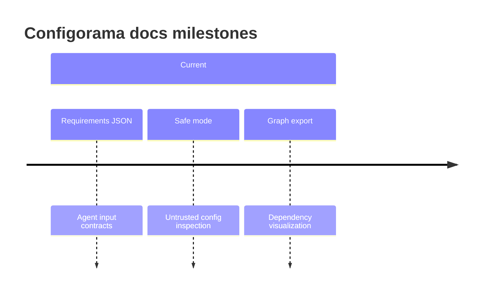

# Changelog

This page summarizes user-facing documentation and inspection milestones rather than replacing the package changelog. It is useful when you want to know why a guide or schema exists, and it links back to reference pages when a change affects automation.



```sh
configorama requirements config.yml
configorama audit config.yml
configorama graph config.yml --format json
```

<Callout type="warning">
  Treat schema changes as automation changes. Review [requirements schema](/reference/requirements-schema), [audit schema](/reference/audit-schema), and [graph schema](/reference/graph-schema) before updating CI consumers.
</Callout>

See [the CLI reference](/reference/cli) and [cross-format semantics](/concepts/cross-format-semantics) for the latest documented behavior.
