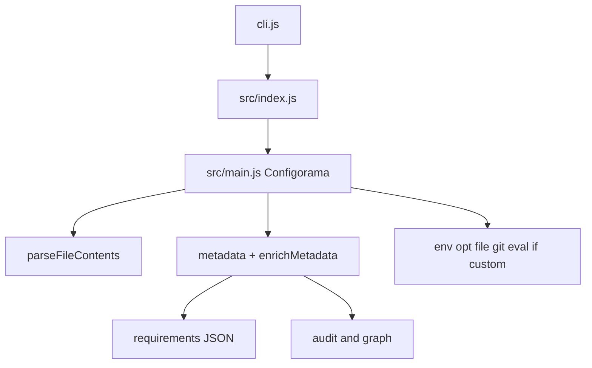

# Architecture

Configorama is a small library and CLI built around one core resolver class. The CLI parses flags and delegates to the library, while the library parses the config file, discovers variable expressions, resolves values in generations, and optionally projects metadata into requirements, audit, and graph reports.

This shape exists because the same behavior needs to serve humans, CI, and agents. The command output can be formatted for people, but the analysis model has to stay stable enough for automation. That is why requirements, audit, and graph output are derived from the enriched metadata path rather than separate walkers.



```js filename="api.js"
const configorama = require('configorama')

const resolved = await configorama('config.yml', {
  options: { stage: 'prod' }
})
```

<Callout type="warning">
  The resolver is intentionally multi-pass. Code that assumes a single left-to-right pass will misunderstand deep references, nested file paths, and fallback chains.
</Callout>

For runtime behavior, read [the resolution model](/concepts/resolution-model). For the shared reporting model, read [the introspection model](/concepts/introspection-model) and [graph guide](/guides/inspect-config#dependency-graph).
