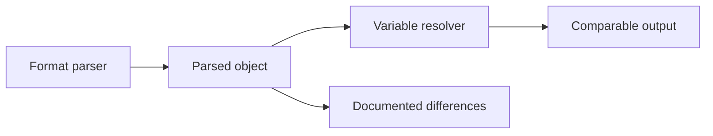

# Cross-format semantics

Configorama supports many file formats, but it does not pretend they are identical. YAML, JSON, TOML, INI, HCL, Markdown frontmatter, JavaScript, and TypeScript can all express overlapping scalar and object values, while arrays, native booleans, comments, executable exports, and HCL syntax have format-specific behavior.

This concept exists because hiding differences creates worse surprises later. The conformance suite proves equivalent behavior where the formats overlap and documents differences where a parser or format changes semantics.



```sh
npm test -- tests/conformance/conformance.test.js
```

<Callout type="warning">
  HCL uses `$[...]` by default to avoid colliding with Terraform's own `${...}` syntax. That makes some fixtures intentionally different from YAML or JSON.
</Callout>

See [the conformance guide](/guides/use-in-ci), [variable sources](/variable-sources), and [filters and functions](/filters-functions) for practical implications.
