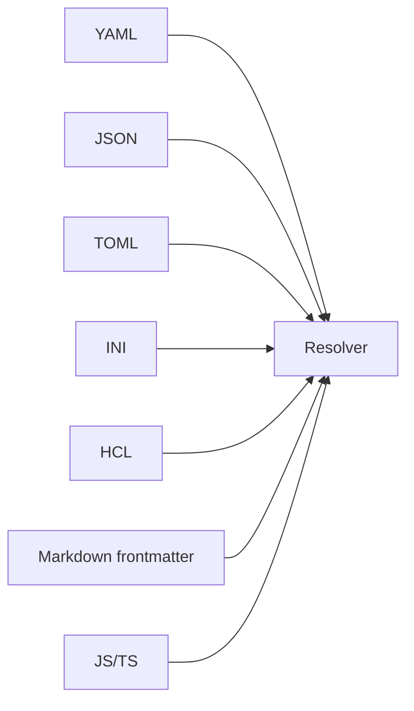

# Formats and semantics

Configorama supports many file formats, but it does not pretend they are identical. YAML, JSON, TOML, INI, HCL, Markdown frontmatter, JavaScript, and TypeScript can all express overlapping scalar and object values, while arrays, native booleans, comments, executable exports, and HCL syntax have format-specific behavior.

This concept exists because hiding differences creates worse surprises later. The conformance suite proves equivalent behavior where the formats overlap and documents differences where a parser or format changes semantics.

## Supported formats

Use the format your ecosystem already expects. YAML is common for deployment, TOML for tool settings, INI for legacy config, HCL for infrastructure, and Markdown frontmatter for content metadata. For dynamic decisions inside those formats, prefer [eval variables](/variables/eval); use JS or TS when executable config is intentionally trusted.



## Markdown frontmatter

Markdown frontmatter is parsed as config and the Markdown body is preserved as content.

```md filename="page.md"
---
title: ${opt:title, "Docs"}
stage: ${opt:stage, "dev"}
---

# Page body
```

Markdown without frontmatter is returned as content, while frontmatter values are resolved like other parsed config values. Hidden HTML-comment frontmatter is a Markdown input feature; it is separate from the JSX comments used by the docs site to synchronize examples.

## YAML behavior

YAML anchors and merge keys apply before variable resolution, which makes them useful for shared defaults.

```yaml filename="config.yml"
defaults: &defaults
  retries: 3
  region: ${opt:region, "us-east-1"}

production:
  <<: *defaults
  debug: false
```

## Conformance

```sh
npm test -- tests/conformance/conformance.test.js
```

<Callout type="warning">
  Cross-format equivalence is only guaranteed where formats overlap. HCL uses `$[...]` by default to avoid colliding with Terraform's own `${...}` syntax, and INI has parser-specific edges.
</Callout>

See [the conformance guide](/guides/use-in-ci), [file references](/guides/file-references), [executable config](/guides/executable-configs), [variable sources](/variable-sources), and [filters and functions](/filters-functions) for practical implications.
