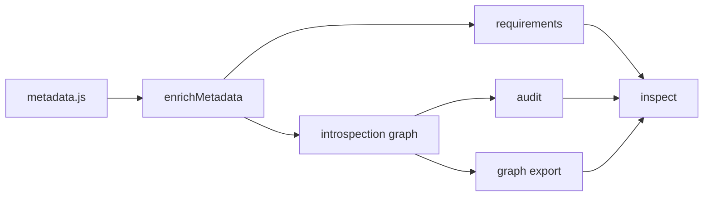

# Introspection model

The introspection model is the shared reporting layer for Configorama. It starts with metadata discovery, enriches that data with comments and resolution context, then projects the same model into requirements JSON, audit JSON, and dependency graph output.

This exists to prevent metadata drift. If requirements, audit, graph, and setup mode each walked config independently, they would eventually disagree about fallbacks, filters, file references, or sensitivity. The implementation keeps `src/metadata.js` and `enrichMetadata` as the source discovery path.

The `inspect` command is the unified entry point over this model: with no `--view` it returns the full `{ requirements, graph, audit }` object, and the `requirements`, `audit`, and `graph` commands are aliases for the individual views.



```sh
configorama inspect config.yml                      # full model: requirements + graph + audit
configorama inspect config.yml --view requirements
configorama inspect config.yml --view audit
configorama inspect config.yml --view graph --format json

# compatibility aliases for the focused views
configorama requirements config.yml
configorama audit config.yml
configorama graph config.yml --format json
```

<Callout type="warning">
  Static introspection cannot fully resolve dynamic targets such as `${file(./${opt:stage}.yml)}`. It records partial edges and diagnostics instead.
</Callout>

Read [dependency graphs](/guides/inspect-config#dependency-graph), [requirements schema](/schemas/requirements), and [audit schema](/schemas/audit) for the concrete outputs.
