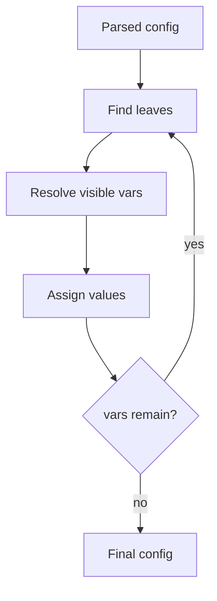

# Resolution model

Resolution starts from parsed config data, then walks terminal values looking for variable syntax. Each generation resolves the variables that are currently visible, updates the object, and repeats until no resolvable variables remain or a failure is found. This is the reason nested and derived values work without recursively resolving every expression immediately.

The model exists to avoid deadlocks and uncontrolled recursion. A self reference may point at another value that also contains a variable, so Configorama uses deep references and generation tracking to keep progress explicit.



```yaml filename="config.yml"
service: billing
stage: ${opt:stage, "dev"}
name: ${self:service}-${self:stage}
workers: ${opt:workers, 2 | Number}
enabled: ${opt:enabled, true | Boolean}
```

Type behavior depends on how the reference appears. A standalone reference can preserve an object, array, number, or boolean. A reference embedded inside surrounding text becomes part of a string. Filters such as `Number`, `Boolean`, and `Json` make the desired type explicit.

<Callout type="warning">
  Fallback values are part of the expression, not separate defaults stored elsewhere. Quoting and filters matter because they change how the fallback is parsed.
</Callout>

See [debug resolution](/guides/debug-resolution) for the practical workflow, [filters and functions](/reference/filters-functions) for transformations, and [variable sources](/reference/variable-sources) for source-specific rules.
