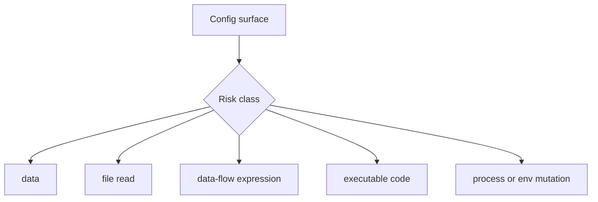

# Security model

Configorama treats config surfaces by risk, not just by source. Environment variables and CLI options are user inputs, file and text references read local files, git variables spawn git commands, `eval` and `if` evaluate sandboxed expressions, and JavaScript or TypeScript file references execute code.

This distinction matters because not every dynamic feature is remote code execution. The expression resolver uses `subscript/justin` with a small context, so it is classified as data-flow risk. To keep that classification honest, expressions are blocked from reaching the prototype chain: any access to `constructor`, `prototype`, or `__proto__` (statically or via a computed key) is rejected with `blocked_eval_escape` before evaluation, so an expression cannot recover the `Function` constructor. JS and TS file references, custom resolvers, custom functions, and dotenv mutation are the surfaces safe mode blocks.



```sh
configorama inspect config.yml --view audit
configorama config.yml --safe --safe-root .
```

<Callout type="warning">
  Safe mode is an inspection and resolution policy, not a sandbox for code you already chose to execute. If a config is untrusted, audit it before resolving it.
</Callout>

For commands, read [safe inspection](/guides/safe-inspection). For exact flags, read [security policies](/reference/security-policies) and [error codes](/reference/error-codes).
