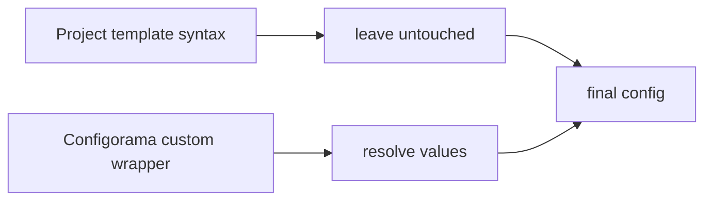

# Bring your own syntax

Configorama defaults to `${...}` because that is familiar in deployment config. Some projects already use `${...}` for CloudFormation, Serverless, Terraform, shell, VTL, or another templating layer. In those projects, change Configorama's wrapper instead of fighting the other system.



Use `buildVariableSyntax(prefix, suffix)` to generate the regex for a custom wrapper:

```js filename="resolve-config.js"
const configorama = require('configorama')
const { buildVariableSyntax } = configorama

const config = await configorama('config.yml', {
  syntax: buildVariableSyntax('<<', '>>')
})
```

Then write Configorama variables with that wrapper:

```yaml filename="config.yml"
stage: <<opt:stage, "dev">>
serviceUrl: https://api.example.com/<<stage>>

resources:
  Outputs:
    Endpoint:
      Value:
        Fn::Sub: https://${ApiGatewayRestApi}.execute-api.${AWS::Region}.amazonaws.com
```

With that setup, Configorama resolves `<<opt:stage, "dev">>` and `<<stage>>`. The `${...}` strings stay untouched for the platform that owns them.

## Common wrappers

```js
buildVariableSyntax('<<', '>>')                 // <<opt:stage, "dev">>
buildVariableSyntax('[[', ']]')                 // [[file(./settings.yml):name]]
buildVariableSyntax('#{', '}')                  // #{param:domain}
buildVariableSyntax('{'.repeat(2), '}'.repeat(2)) // double-curly wrapper
```

Use delimiters that do not already mean something in the files you are resolving. For CloudFormation and Serverless, `<<...>>` is usually easier to scan than another brace-based wrapper.

<Callout type="warning">
  Pick one wrapper per project. Mixing wrappers in the same config makes static inspection and troubleshooting harder.
</Callout>

## Regular expressions

You can pass a custom regular expression when a project already has a wrapper convention.

```js filename="resolve-config.js"
const config = await configorama('config.yml', {
  syntax: /<<([ ~:a-zA-Z0-9=+!@#%*<>?._'",|\-\/()\\]+?)>>/g
})
```

Prefer `buildVariableSyntax(...)` unless you need full control over the character class.

## HCL defaults

When loading `.tf` or `.hcl` files directly, Configorama uses `$[...]` by default so Terraform's native `${...}` interpolation remains Terraform's. If you import HCL from another config format with `file()`, the parent config's syntax applies.

See [CloudFormation compatibility](/guides/cloudformation-serverless), [formats and semantics](/concepts/cross-format-semantics), and [API reference](/api) for related settings.
