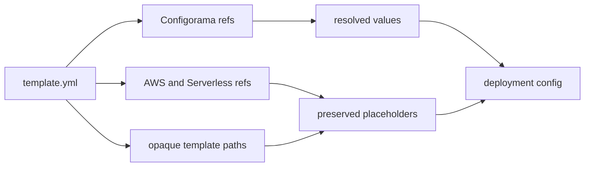

# CloudFormation compatibility

CloudFormation and Serverless templates contain several placeholder systems at once. This guide is for teams that want Configorama to prepare deployment config without taking ownership of the placeholders that AWS, Serverless Framework, shell scripts, VTL, or another deployment layer must resolve later.

The distinction matters because resolving too much is a deployment bug. `${AWS::Region}`, `${AWS::AccountId}`, `${ApiGatewayRestApi}`, `${aws:username}`, shell snippets, and VTL templates often belong to AWS or Serverless. `${env:STAGE}`, `${opt:stage}`, `${file(./vars.yml)}`, and custom typed sources belong to Configorama.



## Built-in guards

Configorama protects the common collision points by default:

| Guard | What it preserves |
|---|---|
| Variable syntax exclusions | `${AWS::...}`, `${aws:...}`, and `${stageVariables...}` are not treated as Configorama variables. |
| `Fn::Sub` handling | CloudFormation placeholders inside `Fn::Sub` are preserved while resolvable Configorama refs can still resolve where supported. |
| CloudFormation YAML schema | Short-form tags such as `!Sub`, `!GetAtt`, `!Join`, and other intrinsic functions parse into their CloudFormation object form. |
| Default ignore paths | Inline Lambda code, CloudFront function code, `UserData`, mapping templates, Step Functions definitions, BuildSpec strings, and CloudFormation init command/file bodies are left verbatim. |

```yaml filename="template.yml"
Resources:
  Function:
    Properties:
      Environment:
        Variables:
          STAGE: ${opt:stage, "dev"}
          TABLE_ARN:
            Fn::Sub: arn:aws:dynamodb:${AWS::Region}:${AWS::AccountId}:table/${Table}
```

`Fn::Sub` list form keeps the template string intact while the variable map can still use Configorama values:

```yaml
Fn::Sub:
  - arn:aws:s3:::${BucketName}/${Stage}
  - Stage: ${opt:stage, "dev"}
```

File references inside an ignored template body are inlined as raw text. That lets dashboard bodies, VTL templates, and embedded JSON keep AWS placeholders such as `${AWS::Region}` while still loading local files intentionally.

## Exclude more paths

If your template stores embedded code or another templating language somewhere project-specific, mark that config path as opaque with `ignorePaths`. Patterns are dot-separated paths; `*` matches one segment and `**` spans multiple segments.

```js filename="resolve-template.js"
const configorama = require('configorama')

const template = await configorama('serverless.yml', {
  ignorePaths: [
    'resources.Resources.*.Properties.CustomTemplate',
    'custom.openapi.paths.**.x-amazon-apigateway-integration.requestTemplates.*'
  ]
})
```

`skipResolutionPaths` is an alias for the same option. If you need complete control, `disableDefaultIgnorePaths: true` turns off the built-in CloudFormation and embedded-code exclusions.

## Bring your own syntax

Some teams avoid `${...}` entirely so Configorama cannot collide with CloudFormation, Serverless, shell, or framework placeholders. Use [bring your own syntax](/guides/bring-your-own-syntax) when a project wants `<<...>>`, a double-curly wrapper, or another wrapper for Configorama variables.

<Callout type="warning">
  Do not rewrite AWS pseudo parameters or IAM policy variables such as `${aws:username}`. They are intentionally preserved for AWS, not resolved by Configorama.
</Callout>

Embedded code paths such as Lambda `Code.ZipFile`, CloudFront `FunctionCode`, shell `UserData`, and dynamic references like `{{resolve:ssm:...}}` should pass through unless a Configorama source is explicitly supported there. See [safe inspection](/guides/inspect-config#audit-risk) for trust policy, [the resolution model](/concepts/resolution-model) for pass-through behavior, and [API reference](/api) for resolver settings.
