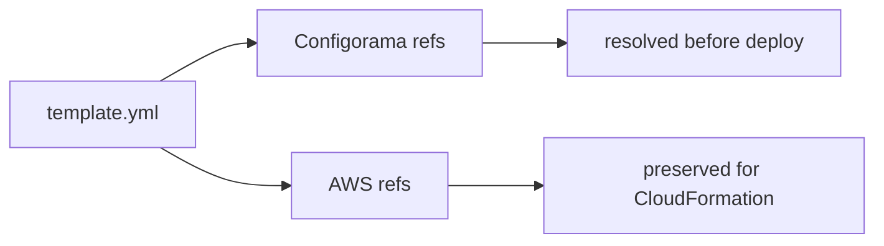

# Use CloudFormation and Serverless

CloudFormation and Serverless templates often contain placeholder syntax that looks like Configorama variables. This guide is for users who want Configorama to resolve its own typed sources while leaving AWS placeholders intact for CloudFormation to resolve later.

The distinction matters because resolving too much is a deployment bug. `${AWS::Region}` and `${ApiGatewayRestApi}` belong to AWS, while `${env:STAGE}` or `${file(./vars.yml)}` belong to Configorama. The parser has to preserve that boundary.



```yaml filename="template.yml"
Resources:
  Function:
    Properties:
      Environment:
        Variables:
          STAGE: ${opt:stage, "dev"}
          TABLE_ARN:
            Fn::Sub: arn:aws:dynamodb:${AWS::Region}:${AWS::AccountId}:table/${Table}
```

`Fn::Sub` list form keeps the template string while resolving values inside the variable map:

```yaml
Fn::Sub:
  - arn:aws:s3:::${BucketName}/${Stage}
  - Stage: ${opt:stage, "dev"}
```

<Callout type="warning">
  Do not rewrite AWS pseudo parameters or IAM policy variables such as `${aws:username}`. They are intentionally preserved for AWS, not resolved by Configorama.
</Callout>

Embedded code paths such as Lambda `Code.ZipFile`, CloudFront `FunctionCode`, shell `UserData`, and dynamic references like `{{resolve:ssm:...}}` should pass through unless a Configorama source is explicitly supported there. See [safe inspection](/guides/safe-inspection) for trust policy and [the resolution model](/concepts/resolution-model) for pass-through behavior.
