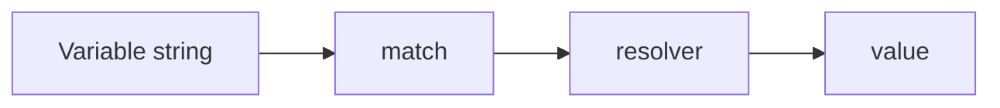

# Write a custom resolver

Custom resolvers are for teams that need values from a source Configorama does not ship with, such as an internal secret store or deployment registry. This guide shows the shape of a resolver and where safe mode changes the trust model.

The extension point exists so the core resolver can stay framework-agnostic. Instead of adding every possible platform source to Configorama itself, applications can provide a small resolver object with a type, match rule, and async resolver function.



```js filename="resolve.js"
const configorama = require('configorama')

const vault = {
  type: 'vault',
  source: 'remote',
  prefix: 'vault',
  match: /^vault:/,
  resolver: async variable => {
    const key = variable.replace(/^vault:/, '')
    return `value-for-${key}`
  }
}

await configorama('config.yml', { variableSources: [vault] })
```

<Callout type="warning">
  Custom resolvers are blocked by safe mode because they are user-provided executable code. Audit output reports them as `custom_extension` risk.
</Callout>

Read [variable sources](/reference/variable-sources) for built-in resolver behavior and [security policies](/reference/security-policies) for safe-mode controls. For API details, see [the API reference](/reference/api).
