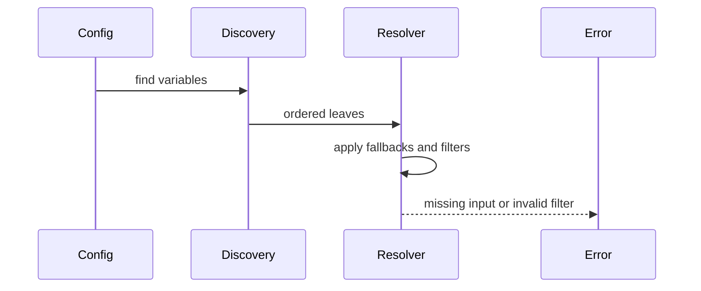

# Debug a failed resolution

This guide helps you diagnose failed or surprising resolution. It is for users who have a config file, a command, and an output that does not match expectations. The fastest path is to inspect requirements first, then use metadata and structured errors to narrow the failing source.

Debugging exists as a workflow because variable resolution is multi-pass. Self references, nested variables, filters, fallbacks, and file references may be resolved in different generations. Looking only at the final error can hide the input that caused it.



```sh
configorama inspect config.yml --view requirements
configorama config.yml --error-format json
```

For path-focused debugging, extract the value you care about directly:

```sh
configorama config.yml .database.host
configorama config.yml ".servers[0].name"
configorama config.yml '.["special-keys"]["key-with-dash"]'
configorama config.yml .service --raw
```

The path extraction tests cover object paths, array indices, negative indices, bracket notation, and scalar `--raw` output. Use this when the whole resolved object is too large to inspect comfortably.

<Callout type="warning">
  Human terminal output is designed for people. Agents and CI should use `--error-format json` and structured error codes instead of scraping styled text.
</Callout>

For deeper inspection, read [the requirements view](/guides/inspect-requirements), [error codes](/reference/error-codes), and [the resolution model](/concepts/resolution-model). If the failing value is a JS or TS file ref, start with [safe inspection](/guides/safe-inspection).
