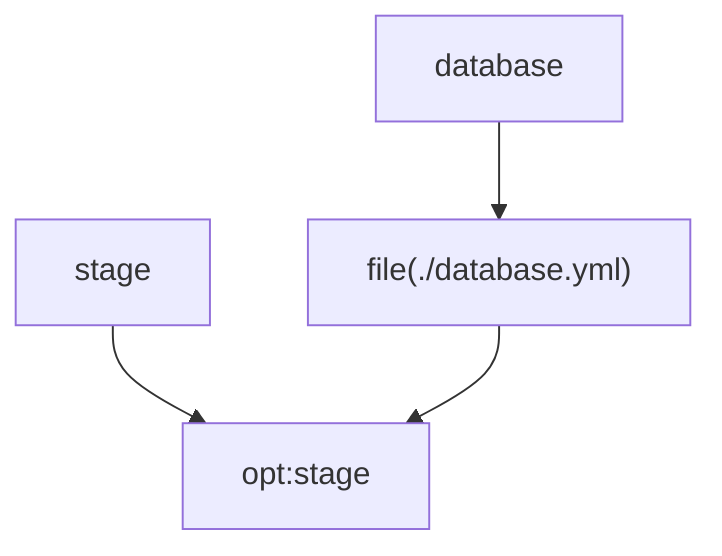

# Generate dependency graphs

Dependency graphs are for users who need to understand where config values come from. They show config paths, variables, file references, executable surfaces, and derived relationships in a format that humans can read and tools can consume.

The graph export exists because large config files hide relationships in strings. A value may depend on an option, a self reference, and a file whose path is partially dynamic. Graph mode makes those relationships visible and deterministic.



```sh
configorama graph config.yml --format json
configorama graph config.yml --format mermaid
configorama graph config.yml --format dot
```

```yaml filename="config.yml"
stage: ${opt:stage, "dev"}
database: ${file(./database.${opt:stage}.yml)}
```

The graph can always show that `database` depends on a file reference and `opt:stage`; it may only know the exact file path after inputs resolve. JSON is the best default for automation, while Mermaid and DOT are useful for reviews.

<Callout type="warning">
  Static graph output is intentionally lossy for dynamic file targets. Configorama emits partial edges and diagnostics instead of pretending it can know every resolved path without inputs.
</Callout>

Use [audit output](/reference/audit-schema) for risk-focused inspection and [graph JSON schema](/reference/graph-schema) when building automation. The design tradeoff is covered in [static vs resolved introspection](/concepts/introspection-model).
