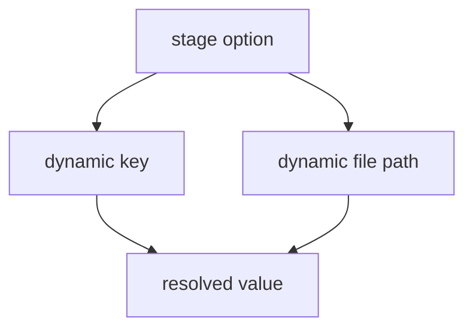

# Build dynamic config

Dynamic configuration is where Configorama becomes more than string replacement. This guide is for users who need one config to select values by stage, tenant, region, feature flag, or command-line parameter while preserving predictable resolution behavior.

The resolver supports this because real deployment config often describes a lookup rather than a literal value. A stage option may select a nested object, a tenant may select a database block, and a file path may depend on the same inputs that control the rest of the config.



Start with simple self references. When a variable name matches a value in the same config, you can omit the `self:` prefix:

```yaml filename="config.yml"
service: checkout
stage: ${opt:stage, "dev"}
name: ${service}-${stage}
url: https://${name}.example.com
```

The same shorthand works inside dynamic paths:

```yaml filename="config.yml"
stage: ${opt:stage, "dev"}
service: checkout
configs:
  dev:
    checkout: http://localhost:3000
  prod:
    checkout: https://checkout.example.com
serviceUrl: ${configs.${stage}.${service}}
stageConfig: ${file(./config.${stage}.json)}
domain: ${param:domain, "example.test"}
```

Dynamic paths can contain more than one variable. This is useful for tenant, region, service, or feature-flag matrices:

```yaml filename="config.yml"
tenant: ${param:tenant, "acme"}
region: ${opt:region, "us"}
service: api

tenantConfigs:
  acme:
    us:
      api: https://api.us.acme.example.com
    eu:
      api: https://api.eu.acme.example.com

serviceUrl: ${self:tenantConfigs.${self:tenant}.${self:region}.${self:service}}
```

The dynamic part can resolve through another key before Configorama reads the final value:

```yaml filename="config.yml"
stage: ${opt:stage, "prod"}
pathByStage:
  prod: services.api.production.url
services:
  api:
    production:
      url: https://api.example.com

apiUrl: ${self:${self:pathByStage.${self:stage}}}
```

Dynamic array indexes use the same dot-path rules:

```yaml filename="config.yml"
selectedIndex: ${opt:serverIndex, 1 | Number}
servers:
  - dev.example.com
  - prod.example.com

serverHost: ${self:servers.${self:selectedIndex}}
```

Conditions and expressions are data-flow helpers, not JavaScript execution. Use them for dynamic config values that do not need a trusted JS or TS module:

```yaml filename="config.yml"
isProd: ${eval(${stage} == "prod")}
replicas: '${eval(${isProd} ? 4 : 1)}'
```

<Callout type="warning">
  Dynamic file targets are only fully known after their inner variables resolve. Static inspection can report the dynamic surface and partial edges, but it should not pretend every possible file path is known.
</Callout>

YAML anchors and merge keys can still be useful before variable resolution, especially for shared defaults. Use explicit type filters such as `Number`, `Boolean`, and `Json` when dynamic values must preserve non-string types. For deeper mechanics, read [the resolution model](/concepts/resolution-model), [eval variables](/variables/eval), and [variable sources](/variable-sources).
