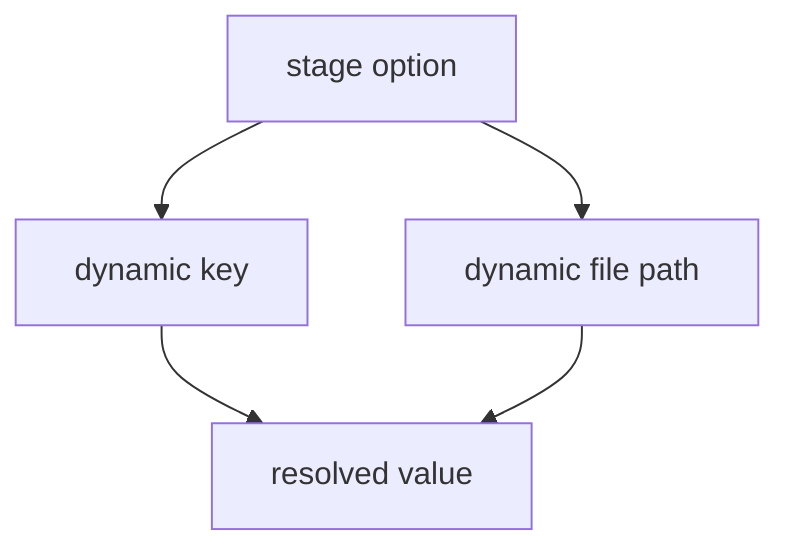

# Build dynamic config

Dynamic configuration is where Configorama becomes more than string replacement. This guide is for users who need one config to select values by stage, tenant, region, feature flag, or command-line parameter while preserving predictable resolution behavior.

The resolver supports this because real deployment config often describes a lookup rather than a literal value. A stage option may select a nested object, a tenant may select a database block, and a file path may depend on the same inputs that control the rest of the config.



```yaml filename="config.yml"
stage: ${opt:stage, "dev"}
service: checkout
configs:
  dev:
    checkout: http://localhost:3000
  prod:
    checkout: https://checkout.example.com
serviceUrl: ${self:configs.${self:stage}.${self:service}}
stageConfig: ${file(./config.${opt:stage}.json)}
domain: ${param:domain, "example.test"}
```

Conditions and expressions are data-flow helpers, not JavaScript execution. Use them for dynamic config values that do not need a trusted JS or TS module:

```yaml filename="config.yml"
isProd: ${eval(${stage} == "prod")}
replicas: '${eval(${isProd} ? 4 : 1)}'
```

<Callout type="warning">
  Dynamic file targets are only fully known after their inner variables resolve. Static inspection can report the dynamic surface and partial edges, but it should not pretend every possible file path is known.
</Callout>

YAML anchors and merge keys can still be useful before variable resolution, especially for shared defaults. Use explicit type filters such as `Number`, `Boolean`, and `Json` when dynamic values must preserve non-string types. For deeper mechanics, read [the resolution model](/concepts/resolution-model), [eval variables](/variables/eval), and [variable sources](/variable-sources).
