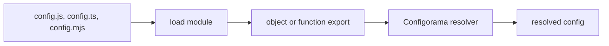

# Use JS, TS, and ESM config

Executable config files are useful when static data files are not expressive enough. This guide is for teams that already trust the repository and want config modules that can export objects, functions, or async functions while still letting Configorama resolve variable strings inside the returned value.

The feature exists because some projects need shared constants, package-local helpers, or computed defaults. The tradeoff is important: loading JavaScript, TypeScript, or ESM runs code. Treat executable config as trusted source code, and use audit or safe inspection before automation reads unknown repositories.



```js filename="config.js"
module.exports = ({ options = {} } = {}) => ({
  service: 'billing',
  stage: options.stage || '${opt:stage, "dev"}',
  host: '${env:API_HOST, "localhost"}'
})
```

```ts filename="config.ts"
export default {
  service: 'billing',
  stage: '${opt:stage, "dev"}',
  workers: '${opt:workers, 2 | Number}'
}
```

```mjs filename="config.mjs"
export default async function config() {
  return {
    service: 'billing',
    stage: '${opt:stage, "dev"}'
  }
}
```

```sh
configorama config.ts --stage prod --workers 4
```

<Callout type="warning">
  Do not run JS, TS, or ESM configs from untrusted repositories. Use `configorama inspect config.ts --view audit` first, and expect `--safe` to block executable config files and executable file references.
</Callout>

The same trust rule applies to `${file(./value.js)}` and `${file(./value.ts)}` references. Pure data file references are covered in [file references](/guides/file-references), while blocked execution behavior is covered in [safe inspection](/guides/inspect-config#audit-risk). For API options such as `dynamicArgs`, see [the API reference](/api).
