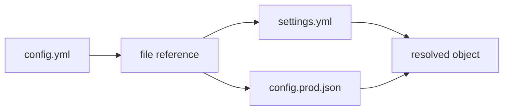

# Load files and secrets

File references let one config read values from another file. This guide is for users who keep shared defaults, stage-specific settings, or secret placeholders outside the main config and want a predictable way to import whole files or selected fields.

This matters because production config rarely lives in one document. A service may use one YAML file for public defaults, one JSON file for generated values, and environment-specific overrides for deployment. File references keep that composition explicit and testable.



{/* docs CONFIGORAMA_EXAMPLE id="file-references-config" lang="yaml" */}
```yaml
stage: ${opt:stage, "dev"}
settings: ${file(./settings.yml)}
databaseHost: ${file(./settings.yml):database.host}
databasePort: ${file(./settings.yml).database.port}
stageConfig: ${file(./config.${opt:stage}.json)}
fallbackValue: ${file(./missing.yml):name, "local"}
```
{/* /docs */}

Aliases can keep long paths readable when a project has a stable config layout:

```yaml filename="config.yml"
appName: ${file(@config/app.yml):name}
featureFlag: ${file(@data/features.json):checkout.enabled}
```

<Callout type="warning">
  JavaScript and TypeScript file references execute code. Use plain YAML, JSON, TOML, INI, HCL, Markdown, or text files for untrusted inspection, and read [executable config](/guides/executable-configs) before using JS/TS file refs.
</Callout>

Missing files can fail, use fallback values, or pass through when unknown refs are explicitly allowed. For exact source syntax, see [variable sources](/reference/variable-sources). For root restrictions and safe-mode behavior, see [safe inspection](/guides/safe-inspection).
