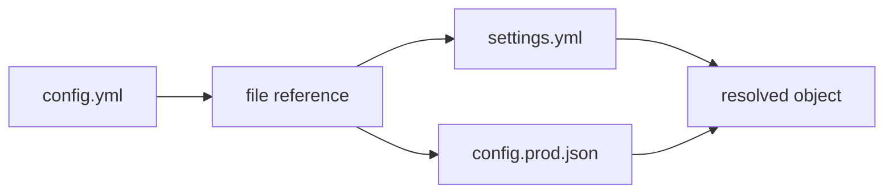

# Load files and secrets

File references let one config read values from another file. This guide is for users who keep shared defaults, stage-specific settings, or secret placeholders outside the main config and want a predictable way to import whole files or selected fields.

This matters because production config rarely lives in one document. A service may use one YAML file for public defaults, one JSON file for generated values, and environment-specific overrides for deployment. File references keep that composition explicit and testable.



{/* docs CONFIGORAMA_EXAMPLE id="file-references-config" lang="yaml" */}
```yaml
stage: ${opt:stage, "dev"}
settings: ${file(./settings.yml)}
databaseHost: ${file(./settings.yml):database.host}
databasePort: ${file(./settings.yml).database.port}
stageConfig: ${file(./config.${opt:stage}.json)}
fallbackValue: ${file(./missing.yml):name, "local"}
```
{/* /docs */}

Aliases can keep long paths readable when a project has a stable config layout:

```yaml filename="config.yml"
appName: ${file(@config/app.yml):name}
featureFlag: ${file(@data/features.json):checkout.enabled}
```

Configorama resolves those aliases from the nearest `tsconfig.json` or `jsconfig.json` path mappings:

```json filename="tsconfig.json"
{
  "compilerOptions": {
    "baseUrl": ".",
    "paths": {
      "@config/*": ["./config/*"],
      "@data/*": ["./data/*"]
    }
  }
}
```

Quoted aliases and fallbacks work the same way as normal file paths:

```yaml filename="config.yml"
appVersion: ${file("@config/app.yml"):version}
localFallback: ${file(@data/missing.json):value, "local"}
```

Secret values do not need to live in the committed config. A common local pattern is to keep the reference in `config.yml` and point it at a gitignored file:

```yaml filename="config.yml"
database:
  password: ${file(./.secrets/local.yml):database.password}
```

```gitignore filename=".gitignore"
.secrets/
```

That keeps the dependency visible without committing the value. If secrets live somewhere else, provide a [custom variable source](/guides/custom-variable-sources) instead of a file reference. Custom variable sources can read from local stores such as the macOS Keychain or 1Password CLI, or from remote stores such as AWS Secrets Manager, GCP Secret Manager, Vault, or your own internal service.

## Override file paths

Use `filePathOverrides` when the config should keep stable references, but a caller needs to redirect specific files for tests, CI, generated artifacts, or local secret material.

```yaml filename="config.yml"
envVars: ${file(./env.yml)}
dbHost: ${file(./env.yml):dbHost}
readmeContent: ${text(./readme.txt)}
```

```js filename="resolve-config.js"
const configorama = require('configorama')

const result = await configorama('config.yml', {
  filePathOverrides: {
    './env.yml': './env.prod.yml',
    './readme.txt': './readme.prod.txt'
  },
  returnMetadata: true
})

console.log(result.config.envVars)
console.log(result.metadata.fileDependencies.overriddenFiles)
```

Override keys are normalized, so `env.yml` and `./env.yml` can match the same config reference. Override values can be relative to the config directory or absolute paths.

<Callout type="warning">
  JavaScript and TypeScript file references execute code. Use plain YAML, JSON, TOML, INI, HCL, Markdown, or text files for untrusted inspection. If you only need derived values, prefer [eval variables](/variables/eval); read [executable config](/guides/executable-configs) before using JS/TS file refs.
</Callout>

Missing files can fail, use fallback values, or pass through when unknown refs are explicitly allowed. For exact source syntax, see [variable sources](/variable-sources). For root restrictions and safe-mode behavior, see [safe inspection](/guides/inspect-config#audit-risk).
