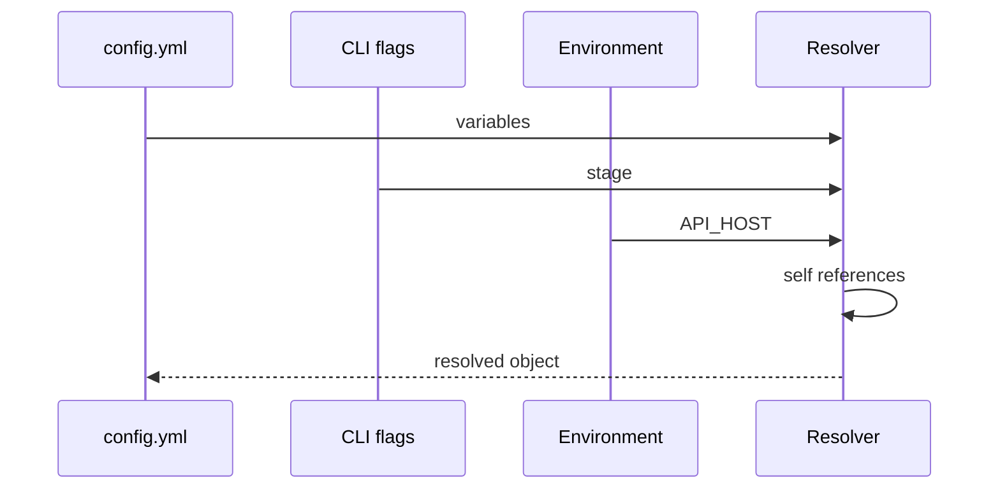

# Resolve your first config

This guide builds a slightly more realistic config with option values, environment values, self references, and type filters. It is for readers who have already installed Configorama and want a copy-pasteable example that shows how multiple sources combine into one plain object.

The resolver exists to keep configuration portable. Instead of baking `prod` or a secret host into the file, the file describes how each value should be discovered. That means the same config can be resolved by a human, CI, or an automation agent with the same semantics.



<Steps>

### Write the file

```yaml filename="config.yml"
service: checkout
stage: ${opt:stage, "dev"}
host: ${env:API_HOST, "localhost"}
baseUrl: https://${self:host}/${self:stage}
workers: ${opt:workers, 2 | Number}
```

### Resolve with production inputs

```sh
API_HOST=api.example.com configorama config.yml --stage prod --workers 4
```

### Verify the shape

```json
{
  "service": "checkout",
  "stage": "prod",
  "host": "api.example.com",
  "baseUrl": "https://api.example.com/prod",
  "workers": 4
}
```

</Steps>

<Callout type="warning">
  Filters run after a value resolves. If `--workers four` is passed with `| Number`, resolution fails instead of silently accepting a string.
</Callout>

For task-oriented next steps, read [debug resolution](/guides/inspect-config#debug-resolution) and [use Configorama in CI](/guides/use-in-ci). For the source vocabulary, see [variable sources](/reference/variable-sources).
