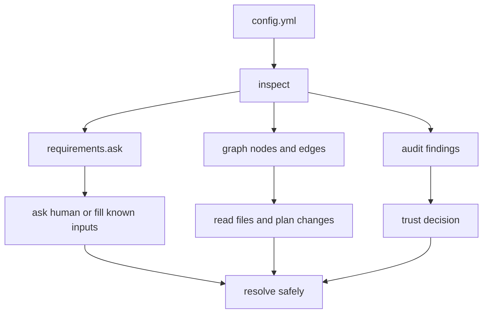

# For agents

AI agents should treat Configorama as a config discovery tool before treating it as a config resolver. The CLI can inspect a file, return the required human inputs, show a directed dependency graph of known config, file, and variable relationships, and identify trust risks before any deployment command runs.

This workflow exists because an agent often cannot finish configuration alone. It can read files, inspect the dependency graph, provide safe defaults, and resolve known values. When a secret, local file, CLI flag, or trust decision is missing, the same output gives the agent a precise question to bring back to the human.



## First command

Start with the full inspect model. It returns `requirements`, `graph`, and `audit` in one JSON object.

```sh
npx --yes configorama inspect config.yml > configorama.inspect.json
```

Use focused views when you want smaller artifacts:

```sh
npx --yes configorama inspect config.yml --view requirements > requirements.json
npx --yes configorama inspect config.yml --view graph --format json > graph.json
npx --yes configorama inspect config.yml --view audit > audit.json
```

## Decide what is missing

`requirements.ask` is the handoff list. It contains inputs the config needs from the environment, CLI options, params, files, or config values.

```sh
jq -r '
  .requirements.ask[]?
  | "- \(.variable): \(.obtainHint // .description // .how // "provide a value")"
' configorama.inspect.json
```

If the list is empty, the agent can usually keep moving. If it has entries, ask the human for only those values.

```txt
I inspected config.yml and need these values before I can resolve it:
- env:STRIPE_SECRET_KEY: Stripe live secret key
- opt:stage: Deployment stage, one of dev, staging, prod

Please provide the values or tell me where they should come from.
```

## Read the dependency graph

The graph view is a directed graph of config paths, variables, files, executable surfaces, and relationships. For normal acyclic config, this gives an agent the order of dependencies it needs to understand before editing or resolving the file.

List file and executable dependencies:

```sh
jq -r '
  .graph.nodes[]?
  | select(.kind == "file" or .kind == "executable")
  | .relativePath // .path // .id
' configorama.inspect.json
```

List edges in review-friendly form:

```sh
jq -r '
  .graph.edges[]?
  | "\(.from) -> \(.to) [\(.kind)]"
' configorama.inspect.json
```

Render a graph for a human review:

```sh
npx --yes configorama inspect config.yml --view graph --format mermaid > configorama-graph.mmd
```

<Callout type="warning">
  Static graph output can be partial for dynamic file paths such as `${file(./config.${opt:stage}.yml)}`. Treat graph diagnostics as work items, not noise.
</Callout>

## Check trust before resolving

Audit output tells the agent whether resolving the config may run code, read files outside an expected root, use dotenv mutation, or invoke user-provided extensions.

```sh
jq -r '
  .audit.findings[]?
  | "- \(.severity): \(.risk) \(.message // .id)"
' configorama.inspect.json
```

If high-risk findings are present, pause and ask for approval before using `--unsafe` or resolving trusted executable config.

## Resolve or collaborate

When the needed inputs are known, pass them through normal CLI flags, environment variables, and params:

```sh
STRIPE_SECRET_KEY=sk_live_example \
  npx --yes configorama config.yml \
  --stage prod \
  --param domain=api.example.com \
  --safe \
  --safe-root . \
  > resolved.json
```

When the value you need is small, extract it directly:

```sh
npx --yes configorama config.yml .database.host --raw --stage prod
```

When the human should drive the answers interactively, hand off to setup mode:

```sh
npx --yes configorama setup config.yml
```

Use the setup wizard for local collaboration. Use `inspect --view requirements` when you need a durable JSON contract for an issue comment, CI artifact, or chat response.

See [inspect config](/guides/inspect-config), [self-configuring config](/guides/setup-wizard), [requirements schema](/schemas/requirements), [graph schema](/schemas/graph), and [security policies](/security-policies) for the underlying contract.
