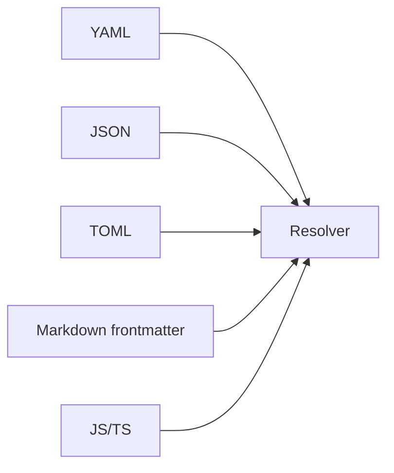

# Use frontmatter and other formats

Configorama can parse several config formats before resolving variables. This guide is for users choosing a format or migrating between formats who need to know where behavior overlaps and where a format has unavoidable differences.

Format support exists so teams can keep the shape their ecosystem already uses. YAML is common for deployment, TOML for tool settings, INI for legacy config, HCL for infrastructure, Markdown for content metadata, and JS/TS when executable config is intentionally trusted.



```md filename="page.md"
---
title: ${opt:title, "Docs"}
stage: ${opt:stage, "dev"}
---

# Page body
```

Markdown without frontmatter is returned as content, while frontmatter values are resolved like other parsed config values. Hidden HTML-comment frontmatter is a Markdown input feature; it is separate from the JSX comments used by the docs site to synchronize examples.

```yaml filename="config.yml"
defaults: &defaults
  retries: 3
  region: ${opt:region, "us-east-1"}

production:
  <<: *defaults
  debug: false
```

<Callout type="warning">
  Cross-format equivalence is only guaranteed where the formats overlap. HCL and INI have parser-specific edges, so documented discrepancies should be called out instead of hidden.
</Callout>

Use [cross-format semantics](/concepts/cross-format-semantics) for the mental model, [file references](/guides/file-references) for importing external files, and [executable config](/guides/executable-configs) before using JS or TS formats in automation.
