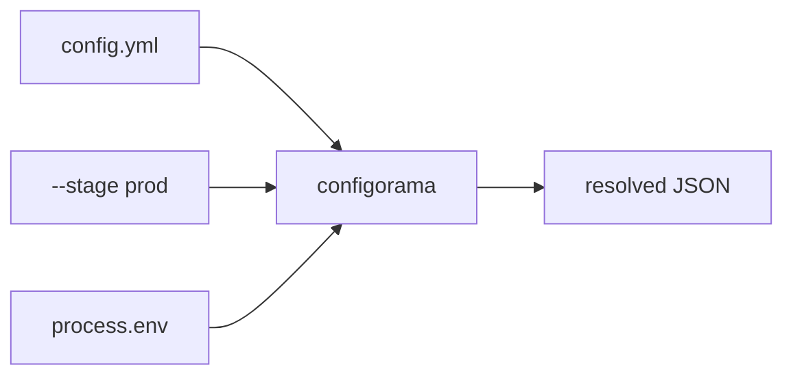

# Get started

This guide gets you from an empty directory to a resolved config in a few minutes. It is for first-time users who want to see the resolver work before reading the full reference. You will create one YAML file, provide one CLI option, and inspect the output that Configorama returns.

Configorama is useful because a config file can name the values it needs without hardcoding every deployment detail. The same file can be used locally, in CI, and in an agent-run setup flow because the resolver accepts inputs from the shell, flags, files, and defaults.

Variables use `${...}` syntax. The basic shape is `${source:name, defaultValue}`: `source` says where to read from, `name` is the key to read, and the optional value after the comma is the fallback.

```yaml
service: billing-api
stage: ${option:stage, "dev"}
host: ${env:DB_HOST, "localhost"}
databaseName: ${service}-${stage}
```

Filters can run after a value resolves. For example, `| Number` turns the fallback or environment value into a number instead of leaving it as a string.



<Steps>

### Install the package

```sh npm2yarn
npm install configorama
```

### Create a config file

```yaml filename="config.yml"
service: billing-api
stage: ${option:stage, "dev"}
database:
  name: ${service}-${stage}
  host: ${env:DB_HOST, "localhost"}
  port: ${env:DB_PORT, 5432 | Number}
```

### Resolve it

```sh
DB_HOST=db.internal configorama config.yml --stage prod
```

</Steps>

Later, the same metadata can drive setup flows. A config that uses `help("Database host")` gives the requirements view and setup mode better user-facing text without changing the resolved value.

```yaml filename="config.yml"
database:
  host: ${env:DB_HOST | help("Database host")}
```

You now have a resolved object where `stage` comes from the CLI option, `database.name` is built from the existing `service` and `stage` values, `database.host` comes from the environment, and `database.port` comes from the fallback. Bare references such as `${service}` and `${stage}` are shorthand for reading from the same config object. Next, try the [setup wizard](/guides/setup-wizard), [resolve a first config](/guides/first-config), or inspect the same file with the [requirements view](/guides/inspect-requirements).
