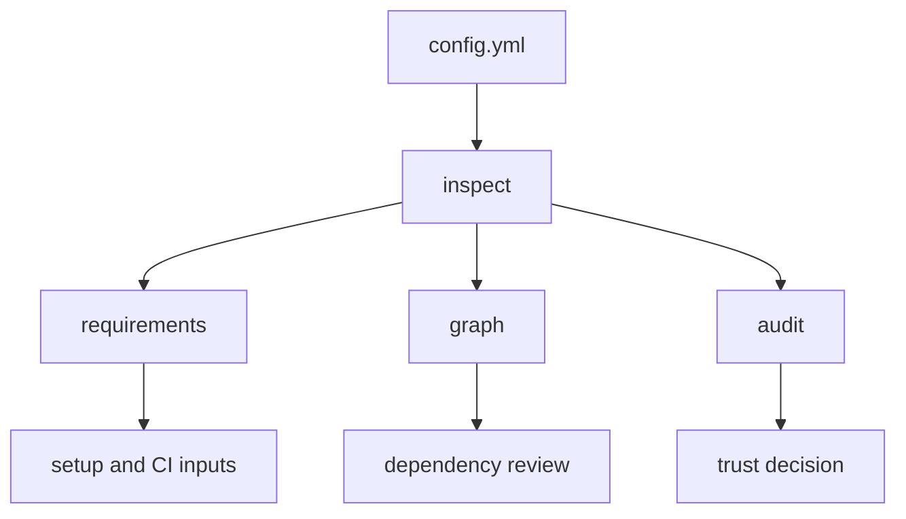

# Inspect config

Use `inspect` when you need to understand a config before resolving it. This guide is for setup flows, CI jobs, reviewers, and agents that need one pre-resolution command for required inputs, dependency graphs, audit findings, and debugging clues.

Inspection exists because resolution can be too late. A config may need secrets, local files, CLI flags, executable file references, or dynamic paths. `inspect` discovers those surfaces first, so humans and automation can decide what to provide, what to trust, and what to review.



```sh
configorama inspect config.yml
configorama inspect config.yml --view requirements
configorama inspect config.yml --view graph --format mermaid
configorama inspect config.yml --view audit
```

Without `--view`, `inspect` returns `requirements`, `graph`, and `audit` together. Use a focused view when a job only needs one output.

## Required inputs

The requirements view tells you what a config needs before it can resolve: missing environment variables, option flags, defaults, allowed values, sensitivity, comments, and conflicts.

```sh
configorama inspect config.yml --view requirements

# compatibility alias
configorama requirements config.yml
```

`requirements` output contains `schemaVersion`, `summary`, `requirements`, and `ask`. Each requirement includes the normalized variable type, paths where it appears, default values, type filters, allowed values, sensitivity, and conflicts.

{/* docs CONFIGORAMA_EXAMPLE id="requirements-config" lang="yaml" */}
```yaml
service: requirements-cli
apiKey: [redacted] | help("API key")}
stage: ${opt:stage, "dev"}
```
{/* /docs */}

```json
{
  "ask": [
    {
      "variable": "env:CONFIGORAMA_REQUIREMENTS_CLI_API_KEY",
      "sourceType": "env",
      "obtainHint": "API key"
    }
  ]
}
```

Comments can enrich the same contract. Leading descriptions and tags such as `@from`, `@example`, `@default`, `@sensitive`, `@group`, and `@deprecated` become machine-readable metadata for setup flows and agents.

```yaml
# Production API token
# @from 1Password shared vault
# @sensitive true
apiToken: ${env:API_TOKEN | help("API token")}
```

<Callout type="warning">
  Requirements output does not mean every dynamic target can be known statically. A path such as `${file(./${opt:stage}.yml)}` is reported with inner variables and partial dependency information.
</Callout>

## Dependency graph

The graph view shows where config values come from. It includes config paths, variables, file references, executable surfaces, and derived relationships in JSON, Mermaid, or DOT.

```sh
configorama inspect config.yml --view graph --format json
configorama inspect config.yml --view graph --format mermaid
configorama inspect config.yml --view graph --format dot

# compatibility alias
configorama graph config.yml --format mermaid
```

```yaml filename="config.yml"
stage: ${opt:stage, "dev"}
database: ${file(./database.${opt:stage}.yml)}
```

The graph can show that `database` depends on a file reference and `opt:stage`; it may only know the exact file path after inputs resolve. JSON is best for automation. Mermaid and DOT are useful for reviews.

<Callout type="warning">
  Static graph output is intentionally lossy for dynamic file targets. Configorama emits partial edges and diagnostics instead of pretending it can know every resolved path without inputs.
</Callout>

## Audit risk

The audit view is for repositories you do not automatically trust. It reports risk surfaces before resolution, especially executable config, JS/TS file references, custom resolvers, dotenv loading, and file reads.

```sh
configorama inspect config.yml --view audit
configorama inspect config.yml
configorama config.yml --safe --safe-root .

# compatibility alias
configorama audit config.yml
```

`inspect` defaults to safe inspection: file and text reads are scoped to the config directory, and executable surfaces are reported rather than run. Pass `--unsafe` only when the repository is trusted and you intentionally want normal inspection behavior.

{/* docs CONFIGORAMA_EXAMPLE id="safe-inspection-config" lang="yaml" */}
```yaml
safeData: ${file(./data.yml):value}
unsafeData: [redacted]}
```
{/* /docs */}

In safe mode, the YAML file read can be allowed by root policy, while the JavaScript file reference is blocked because loading it would execute code. Audit mode can report that executable surface before resolution.

<Callout type="warning">
  `eval` and `if` are classified as sandboxed data-flow expressions, not JavaScript execution. JS/TS file references are the high-risk execution surface.
</Callout>

Safe mode defaults file and text references to the config directory unless you pass allowed roots. Root restrictions block traversal outside configured roots, and safe mode also blocks dotenv mutation, custom resolvers, and custom functions unless policy explicitly permits them.

## Debug resolution

When a resolved value is wrong or missing, start with inspection, then run resolution with structured errors:

```sh
configorama inspect config.yml
configorama config.yml --error-format json
```

For path-focused debugging, extract the value you care about directly:

```sh
configorama config.yml .database.host
configorama config.yml ".servers[0].name"
configorama config.yml '.["special-keys"]["key-with-dash"]'
configorama config.yml .service --raw
```

The path extraction tests cover object paths, array indices, negative indices, bracket notation, and scalar `--raw` output. Use this when the whole resolved object is too large to inspect comfortably.

Human terminal output is designed for people. Agents and CI should use `--error-format json`, inspect JSON, and structured error codes instead of scraping styled text.

See [requirements schema](/schemas/requirements), [graph schema](/schemas/graph), [audit schema](/schemas/audit), [security policies](/security-policies), and [error codes](/schemas/error-codes) for exact fields and flags.
