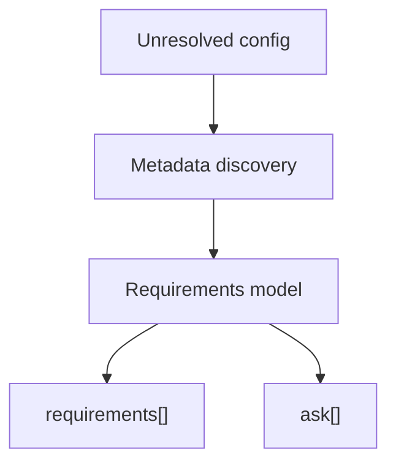

# Inspect required inputs

Use requirements mode when you need to know what a config needs before you resolve it. This guide is for CI jobs, agents, and setup flows that need a stable JSON contract for missing environment variables, option flags, defaults, allowed values, sensitivity, and comments from the config file.

The command exists because failed resolution is too late for many workflows. A CI job may need to ask for secrets, and an agent may need to gather inputs without executing arbitrary JavaScript. Requirements JSON turns discovery into a machine-readable plan.



```sh
configorama requirements config.yml
```

The output contains `schemaVersion`, `summary`, `requirements`, and `ask`. Each requirement includes the normalized variable type, paths where it appears, default values, type filters, allowed values, sensitivity, and conflicts.

{/* docs CONFIGORAMA_EXAMPLE id="requirements-config" lang="yaml" */}
```yaml
service: requirements-cli
apiKey: [redacted] | help("API key")}
stage: ${opt:stage, "dev"}
```
{/* /docs */}

```json
{
  "ask": [
    {
      "variable": "env:CONFIGORAMA_REQUIREMENTS_CLI_API_KEY",
      "sourceType": "env",
      "obtainHint": "API key"
    }
  ]
}
```

Comments can enrich the same contract. Tests under `tests/annotations` cover leading descriptions plus tags such as `@from`, `@example`, `@default`, `@sensitive`, `@group`, and `@deprecated`, which become machine-readable metadata for setup flows and agents.

```yaml
# Production API token
# @from 1Password shared vault
# @sensitive true
apiToken: ${env:API_TOKEN | help("API token")}
```

<Callout type="warning">
  Requirements mode does not mean every dynamic target can be known statically. A path such as `${file(./${opt:stage}.yml)}` is reported with inner variables and partial dependency information.
</Callout>

Use [safe inspection](/guides/safe-inspection) when the repository is untrusted, or use [the requirements schema reference](/reference/requirements-schema) when you need exact field definitions. [Debug resolution](/guides/debug-resolution) explains how this model relates to runtime history.
