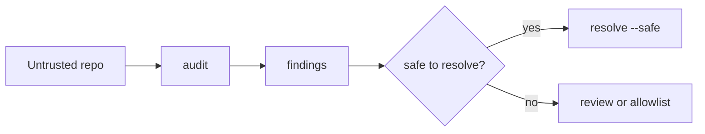

# Safely inspect untrusted config

Safe inspection is for agents, CI systems, and reviewers looking at repositories they do not automatically trust. It lets you inspect risk surfaces before resolution, and it blocks executable or mutating behavior when you do choose to run the resolver.

This matters because config files can be executable. YAML and JSON are mostly data, but JavaScript and TypeScript config files, JS/TS file references, custom resolvers, custom functions, dotenv loading, and git commands have different trust implications. Safe mode gives those surfaces explicit policy.



```sh
configorama inspect config.yml --view audit
configorama inspect config.yml                # full model: requirements, graph, and audit at once
configorama config.yml --safe --safe-root .

# compatibility alias
configorama audit config.yml
```

`inspect` defaults to safe inspection (file/text reads scoped to the config directory, executable surfaces reported but not run). Pass `--unsafe` to opt out of that default.

{/* docs CONFIGORAMA_EXAMPLE id="safe-inspection-config" lang="yaml" */}
```yaml
safeData: ${file(./data.yml):value}
unsafeData: [redacted]}
```
{/* /docs */}

In safe mode, the YAML file read can be allowed by root policy, while the JavaScript file reference is blocked because loading it would execute code. Audit mode can report that executable surface before resolution.

<Callout type="warning">
  `eval` and `if` are classified as sandboxed data-flow expressions, not JavaScript execution. JS/TS file references are the high-risk execution surface.
</Callout>

Safe mode defaults file and text references to the config directory unless you pass allowed roots. Root restrictions block traversal outside the configured roots, and safe mode also blocks dotenv mutation, custom resolvers, and custom functions unless policy explicitly permits them. Read [security policies](/reference/security-policies) for the exact flags, and [the security model](/concepts/security-model) for the trust boundary explanation.
