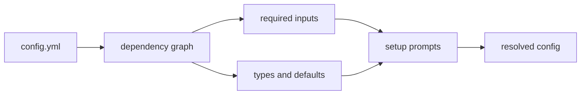

# Self configuring config

A Configorama file can be self configuring because Configorama can inspect it before resolving it, build a graph of the values it depends on, and use that graph to walk a human or agent through the setup process.

That graph includes environment variables, CLI options, file references, self references, defaults, type filters, allowed values, sensitivity, and prompt text. The setup wizard turns those dependencies into questions, then resolves the config with the answers for the current run.



## Run it

```sh
configorama setup config.yml
```

Use `npx` when Configorama is not installed in the project:

```sh
npx --yes configorama setup config.yml
```

You can also run the same flow through the resolve command:

```sh
configorama config.yml --setup
```

## Add prompt text

The wizard is strongest when the config explains its own dependencies. Use `help()` for short prompt text, or use comments when the prompt needs examples, source notes, grouping, or sensitivity.

```yaml filename="config.yml"
service: billing-api
stage: ${option:stage | oneOf("dev", "staging", "prod") | help("Deployment stage")}

database:
  host: ${env:DB_HOST | help("Database host")}
  port: ${env:DB_PORT, 5432 | Number | help("Database port")}

secrets:
  # Stripe live secret key
  # @from Stripe dashboard > Developers > API keys
  # @example sk_live_...
  # @sensitive true
  stripeKey: ${env:STRIPE_SECRET_KEY}
```

In this example, `stage` becomes a select prompt because `oneOf(...)` defines the allowed values in the dependency graph. `database.port` is validated as a number. `secrets.stripeKey` is treated as sensitive because the annotation says so, and names such as `secret`, `password`, `token`, and `key` are also masked by default.

## What it prompts for

The wizard groups dependency inputs by source:

| Source | Prompt behavior |
|---|---|
| `option` / `opt` | Asks for the CLI flag value, such as `--stage`. |
| `env` | Uses the current environment value if it exists, or asks for one. |
| `file` / `text` | Prompts for file-backed inputs when they appear in requirements output. |
| `self` and bare config refs | Prompts only when the referenced config value is not already resolved. |

Defaults are shown as placeholders and used when the prompt is left blank. Type filters such as `Number`, boolean filters, JSON/object filters, and array filters are used for validation and normalization, so the prompt behavior follows the same dependency data that resolution uses.

<Callout type="warning">
  The wizard fills values for the current resolution run only. It does not edit `config.yml`, write `.env` files, or persist secrets.
</Callout>

For CI and agents, use `configorama inspect config.yml --view requirements` instead. The requirements output is the durable JSON contract behind the wizard, and it is easier to review, diff, and store as an artifact.

See [inspect required inputs](/guides/inspect-config#required-inputs) for the JSON shape and [filters and functions](/reference/filters-functions) for `help()` and `oneOf(...)`.
