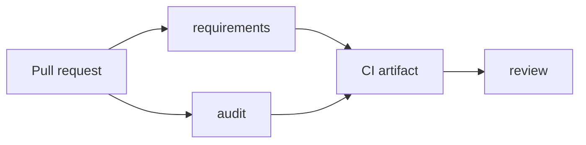

# Use Configorama in CI

CI usage is about predictable machine output. This guide is for teams that want pull requests to fail on missing inputs, collect audit reports, or publish graph artifacts without relying on terminal formatting meant for humans.

Configorama helps CI because it separates inspection from resolution. A workflow can generate one inspect artifact, gate on it with `jq`, and only resolve after the job provides the expected inputs and safe roots.



## Run from CI

Use `npx` when the repository does not install Configorama as a project dependency:

```sh
npx --yes configorama inspect config.yml > configorama.inspect.json
```

Pin the package version in locked-down CI jobs:

```sh
npx --yes configorama@0.11.2 inspect config.yml > configorama.inspect.json
```

`inspect` with no `--view` returns `requirements`, `graph`, and `audit` together. That keeps the job simple because every later check reads the same JSON file.

```yaml filename=".github/workflows/config.yml"
name: config

on:
  pull_request:

jobs:
  inspect-config:
    runs-on: ubuntu-latest
    steps:
      - uses: actions/checkout@v4
      - run: npx --yes configorama inspect config.yml > configorama.inspect.json
      - uses: actions/upload-artifact@v4
        with:
          name: configorama-inspect
          path: configorama.inspect.json
```

Use focused views if the job wants separate files:

```sh
npx --yes configorama inspect config.yml --view requirements > requirements.json
npx --yes configorama inspect config.yml --view audit > audit.json
npx --yes configorama inspect config.yml --view graph > graph.json
```

## Gate with jq

Fail the pull request when required inputs are still missing:

```sh
jq -e '(.requirements.ask | length) == 0' configorama.inspect.json
```

Print the missing inputs in a review-friendly form:

```sh
jq -r '
  .requirements.ask[]?
  | "- \(.variable): \(.how // .obtainHint // "provide a value")"
' configorama.inspect.json
```

Fail on executable or other high-severity audit findings:

```sh
jq -e '(.audit.summary.high // 0) == 0' configorama.inspect.json
```

Print the high-risk findings before failing:

```sh
jq -r '
  .audit.findings[]?
  | select(.severity == "high")
  | "- \(.risk): \(.variable // .relativePath // .path // .id) \(.message)"
' configorama.inspect.json
```

List local files that the config may read:

```sh
jq -r '
  .graph.nodes[]?
  | select(.kind == "file" or .kind == "executable")
  | .relativePath // .path // .id
' configorama.inspect.json
```

Resolve only after the CI job has the inputs it needs:

```sh
npx --yes configorama config.yml --safe --safe-root . > resolved.json
```

Conformance and performance guardrails should be separate CI jobs. Conformance locks down behavior across formats and outputs; performance smoke tests catch obvious slowdowns in large configs, metadata mode, requirements inspection, and graph inspection without pretending to be microbenchmarks.

<Callout type="warning">
  Do not inject production secrets into pull-request jobs from forks. Use requirements JSON to prove which secrets are needed, then resolve in a trusted deployment job.
</Callout>

See [structured error codes](/reference/error-codes) for automation branching, [safe inspection](/guides/safe-inspection) for trust policy, and [requirements schema](/reference/requirements-schema) for artifact fields.
