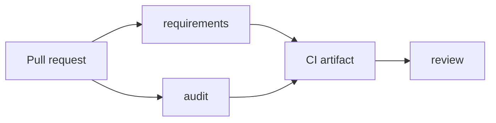

# Use Configorama in CI

CI usage is about predictable machine output. This guide is for teams that want pull requests to fail on missing inputs, collect audit reports, or publish graph artifacts without relying on terminal formatting meant for humans.

Configorama helps CI because it separates inspection from resolution. A workflow can generate requirements JSON, audit untrusted surfaces, and only resolve after the job provides the expected inputs and roots.



```yaml filename=".github/workflows/config.yml"
steps:
  - run: npm ci
  - run: configorama requirements config.yml > requirements.json
  - run: configorama audit config.yml > audit.json
  - run: configorama graph config.yml --format json > graph.json
  - run: configorama config.yml --safe --safe-root . > resolved.json
```

Conformance and performance guardrails should be separate CI jobs. Conformance locks down behavior across formats and outputs; performance smoke tests catch obvious slowdowns in large configs, metadata mode, analyze mode, requirements mode, and explain-like inspection paths without pretending to be microbenchmarks.

<Callout type="warning">
  Do not inject production secrets into pull-request jobs from forks. Use requirements JSON to prove which secrets are needed, then resolve in a trusted deployment job.
</Callout>

See [structured error codes](/reference/error-codes) for automation branching, [safe inspection](/guides/safe-inspection) for trust policy, and [requirements schema](/reference/requirements-schema) for artifact fields.
