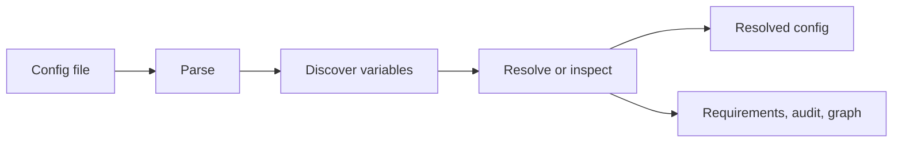

# Configorama

Configorama is a framework-agnostic resolver for dynamic configuration files. It reads YAML, JSON, TOML, INI, HCL, Markdown frontmatter, JavaScript, and TypeScript, then resolves variables from environment values, CLI options, files, git metadata, expressions, and custom sources. The docs are for people who need repeatable config behavior in local tools, CI jobs, deployment scripts, and agent workflows.

It exists because modern config rarely lives in one file anymore. A service config may depend on stage flags, secret environment variables, generated JavaScript, shared JSON files, and derived values. Configorama gives that flow one resolver, plus inspection modes that show what the config needs before you trust or execute it.

<Cards num={2}>
  <Cards.Card title="Get started" href="/guides/get-started" arrow>
    Install the package and resolve a small config.
  </Cards.Card>
  <Cards.Card title="Inspect config" href="/guides/inspect-config" arrow>
    Review required inputs, dependency graphs, audit findings, and debug output.
  </Cards.Card>
  <Cards.Card title="CLI and API" href="/cli" arrow>
    Look up commands, API settings, schemas, sources, filters, and error codes.
  </Cards.Card>
</Cards>

## Example

For example, given this simple yaml config file:

{/* docs CONFIGORAMA_EXAMPLE id="getting-started-config" lang="yaml" */}
```yaml
service: billing
stage: ${opt:stage, "dev"}
```
{/* /docs */}

Running it through the CLI:

```sh
npm install configorama
configorama config.yml --stage prod
```

You get this resolved output:

{/* docs CONFIGORAMA_RESULT id="getting-started-output" lang="json" */}
```json
{
  "service": "billing",
  "stage": "prod"
}
```
{/* /docs */}

You can call the same resolver programmatically:

```js filename="resolve-config.js"
const configorama = require('configorama')

async function loadConfig() {
  const config = await configorama('config.yml', {
    options: {
      stage: 'prod'
    }
  })

  console.log(config)
}

loadConfig().catch(error => {
  console.error(error)
  process.exitCode = 1
})
```

## How it works



The main paths through these docs are [the first config guide](/guides/first-config), [inspect config](/guides/inspect-config), [the CLI reference](/cli), and [the API reference](/api). Read [the architecture concept](/concepts/architecture) when you want the mental model behind the commands.
